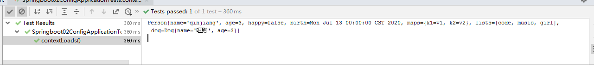

# yaml语法学习


## 配置文件

SpringBoot使用一个全局的配置文件 ， 配置文件名称是固定的

- application.properties

- - 语法结构 ：key=value

- application.yaml

- - 语法结构 ：key：<font color=red>空格</font> value

**配置文件的作用 ：**修改SpringBoot自动配置的默认值，因为SpringBoot在底层都给我们自动配置好了；

比如我们可以在配置文件中修改Tomcat 默认启动的端口号！测试一下！

```yaml
server:
  port: 8081
```


## YAML

### yaml概述

- YAML是 "YAML Ain't a Markup Language" （YAML不是一种标记语言）的递归缩写。在开发的这种语言时，YAML 的意思其实是："Yet Another Markup Language"（仍是一种标记语言）

- 这种语言以**数据**作为中心，而不是以标记语言为重点！

- 以前的配置文件，大多数都是使用xml来配置；比如一个简单的端口配置，我们来对比下yaml和xml

  - 传统xml配置：

    ```xml
    <server>
        <port>8081<port>
    </server>
    ```

  - yaml配置：

    ```yaml
    server：
      prot: 8080
    ```

### yaml基础语法

**说明：语法要求严格！**

1. 空格不能省略

2. 以缩进来控制层级关系，只要是左边对齐的一列数据都是同一个层级的。

3. 属性和值的大小写都是十分敏感的。


**字面量：普通的值  [ 数字，布尔值，字符串  ]**

- 字面量直接写在后面就可以 ， 字符串默认不用加上双引号或者单引号；`k: v`

  注意：

  - <font color=red>“ ” 双引号</font>，不会转义字符串里面的特殊字符 ， 特殊字符会作为本身想表示的意思；

    比如 ：name: "kuang \n shen"   输出 ：kuang  换行   shen

  - <font color=red>'' 单引号</font>，会转义特殊字符 ， 特殊字符最终会变成和普通字符一样输出

    比如 ：name: ‘kuang \n shen’   输出 ：kuang  \n   shen

**对象、Map（键值对）**

```yaml
#对象、Map格式
k: 
    v1:
    v2:
```

在下一行来写对象的属性和值得关系，注意缩进；比如：

```yaml
student:
    name: qinjiang
    age: 3
```

行内写法

```yaml
student: {name: qinjiang,age: 3}
```


**数组（ List、set ）**

用 - 值表示数组中的一个元素,比如：

```yaml
pets:
 - cat
 - dog
 - pig
```

行内写法

```yaml
pets: [cat,dog,pig]
```

**修改SpringBoot的默认端口号**

配置文件中添加，端口号的参数，就可以切换端口；

```yaml
server:
  port: 8082
```

# 注入配置文件

- yaml文件更强大的地方在于，他可以给我们的实体类直接注入匹配值！

## yaml注入配置文件

1. 在springboot项目中的resources目录下新建一个文件 application.yaml

2. 编写一个实体类 Dog；

   ```java
   package nuc.ss.pojo;
   
   @Component  //注册bean到容器中
   public class Dog {
       private String name;
       private Integer age;
       
       //有参无参构造、get、set方法、toString()方法  
   }
   ```

3. 思考，我们原来是如何给bean注入属性值的！@Value，给狗狗类测试一下：

   ```java
   @Component //注册bean
   public class Dog {
       @Value("阿黄")
       private String name;
       @Value("18")
       private Integer age;
   }
   ```

4. 在SpringBoot的测试类下注入狗狗输出一下；

   ```java
   @SpringBootTest
   class Springboot02ConfigApplicationTests {
   
       @Autowired
       private Dog dog;
   
       @Test
       void contextLoads() {
           System.out.println(dog);
       }
   
   }
   
   ```

   结果成功输出，@Value注入成功，这是我们原来的办法对吧。

   

5. 我们在编写一个复杂一点的实体类：Person 类

   ```java
   @Component //注册bean到容器中
   public class Person {
       private String name;
       private Integer age;
       private Boolean happy;
       private Date birth;
       private Map<String,Object> maps;
       private List<Object> lists;
       private Dog dog;
       
       //有参无参构造、get、set方法、toString()方法  
   }
   ```

6. 我们来使用yaml配置的方式进行注入，大家写的时候注意区别和优势，我们编写一个yaml配置！

   ```yaml
   person:
     name: qinjiang
     age: 3
     happy: false
     birth: 2000/01/01
     maps: {k1: v1,k2: v2}
     lists:
      - code
      - girl
      - music
     dog:
       name: 旺财
       age: 1
   ```

7. 我们刚才已经把person这个对象的所有值都写好了，我们现在来注入到我们的类中！

   ```java
   /*
   @ConfigurationProperties作用：
   将配置文件中配置的每一个属性的值，映射到这个组件中；
   告诉SpringBoot将本类中的所有属性和配置文件中相关的配置进行绑定
   参数 prefix = “person” : 将配置文件中的person下面的所有属性一一对应
   */
   @Component
   @ConfigurationProperties(prefix = "person")
   public class Person {
       private String name;
       private Integer age;
       private Boolean happy;
       private Date birth;
       private Map<String,Object> maps;
       private List<Object> lists;
       private Dog dog;
   
       //有参无参构造、get、set方法、toString()方法
   }
   
   ```
   
8. IDEA 提示，springboot配置注解处理器没有找到，让我们看文档，我们可以查看文档，找到一个依赖！
	
	- 注解@ConfigurationProperties(prefix = "person")
	
	  点击 open Decumentation进入官网
	
	- 在pom中导入依赖

        ```xml
        <dependency>
            <groupId>org.springframework.boot</groupId>
            <artifactId>spring-boot-configuration-processor</artifactId>
            <optional>true</optional>
        </dependency>
        ```

9. 确认以上配置都OK之后，我们去测试类中测试一下：

   ```java
   @SpringBootTest
   class Springboot02ConfigApplicationTests {
       @Autowired
       private Person person;
       @Test
       void contextLoads() {
           System.out.println(person);
       }
   
   }
   
   ```

   结果：所有值全部注入成功！

   

**yaml配置注入到实体类完全OK！**

## 加载指定的配置文件

- **@PropertySource ：**加载指定的配置文件；
- **@configurationProperties**：默认从全局配置文件中获取值；


1. 我们去在resources目录下新建一个**person.properties**文件

   ```yaml
   name=kuangshen
   ```

2. 然后在我们的代码中指定加载person.properties文件

   ```java
   @PropertySource(value = "classpath:person.properties")
   @Component //注册bean
   public class Person {
   
       @Value("${name}")
       private String name;
   
       ......  
   }
   ```

3. 再次输出测试一下：指定配置文件绑定成功！

   

## 配置文件占位符

配置文件还可以编写占位符生成随机数

```yaml
person:
  name: qinjiang${random.uuid}
  age: ${random.int}
  happy: false
  birth: 2020/07/13
  maps: {k1: v1,k2: v2}
  lists:
    - code
    - music
    - girl
  dog:
    name: ${person.hell:hello}_旺财
    age: 3
```


## 回顾properties配置

- 我们上面采用的yaml方法都是最简单的方式，开发中最常用的；
- 也是springboot所推荐的！
- 那我们来唠唠其他的实现方式，道理都是相同的；写还是那样写；配置文件除了yml还有我们之前常用的properties ， 我们没有讲，我们来唠唠！

<font color=red>【注意】</font>`properties`配置文件在写中文的时候，会有<font color=red>乱码 </font>， 我们需要去IDEA中设置编码格式为UTF-8；settings-->FileEncodings 中配置；


## 对比小结

@Value这个使用起来并不友好！我们需要为每个属性单独注解赋值，比较麻烦；我们来看个功能对比图

|                | @ConfigurationProperties | @Value     |
| -------------- | ------------------------ | ---------- |
| 功能           | 批量注入配置文件中的属性 | 一个个指定 |
| 松散绑定       | 支持                     | 不支持     |
| SpEL           | 不支持                   | 支持       |
| JSR303数据校验 | 支持                     | 不支持     |
| 复杂类型封装   | 支持                     | 不支持     |

1. `@ConfigurationProperties`只需要写一次即可 ， @Value则需要每个字段都添加

2. <font color=red>松散绑定</font>：这个什么意思呢? 比如我的yml中写的last-name，这个和lastName是一样的， - 后面跟着的字母默认是大写的。这就是松散绑定。可以测试一下

3. JSR303数据校验 ， 这个就是我们可以在字段是增加一层过滤器验证 ， 可以保证数据的合法性

4. 复杂类型封装，yml中可以封装对象 ， 使用value就不支持

**结论：**

配置yml和配置properties都可以获取到值 ， **<font color=red>强烈推荐 yml</font>**；

如果我们在某个业务中，只需要获取配置文件中的某个值，可以使用一下 @value；

如果说，我们专门编写了一个**JavaBean来和配置文件进行一一映射**，就直接**@configurationProperties**，不要犹豫！