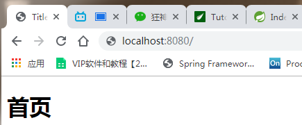
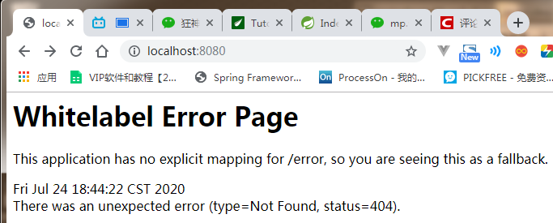

# MVC自动配置原理

## 官网阅读

在进行项目编写前，我们还需要知道一个东西，就是SpringBoot对我们的SpringMVC还做了哪些配置，包括如何扩展，如何定制。

只有把这些都搞清楚了，我们在之后使用才会更加得心应手。途径一：源码分析，途径二：官方文档！

地址 ：https://docs.spring.io/spring-boot/docs/2.2.5.RELEASE/reference/htmlsingle/#boot-features-spring-mvc-auto-configuration

```shell
Spring MVC Auto-configuration
// Spring Boot为Spring MVC提供了自动配置，它可以很好地与大多数应用程序一起工作。
Spring Boot provides auto-configuration for Spring MVC that works well with most applications.
// 自动配置在Spring默认设置的基础上添加了以下功能：
The auto-configuration adds the following features on top of Spring’s defaults:
// 包含视图解析器
Inclusion of ContentNegotiatingViewResolver and BeanNameViewResolver beans.
// 支持静态资源文件夹的路径，以及webjars
Support for serving static resources, including support for WebJars 
// 自动注册了Converter：
// 转换器，这就是我们网页提交数据到后台自动封装成为对象的东西，比如把"1"字符串自动转换为int类型
// Formatter：【格式化器，比如页面给我们了一个2019-8-10，它会给我们自动格式化为Date对象】
Automatic registration of Converter, GenericConverter, and Formatter beans.
// HttpMessageConverters
// SpringMVC用来转换Http请求和响应的的，比如我们要把一个User对象转换为JSON字符串，可以去看官网文档解释；
Support for HttpMessageConverters (covered later in this document).
// 定义错误代码生成规则的
Automatic registration of MessageCodesResolver (covered later in this document).
// 首页定制
Static index.html support.
// 图标定制
Custom Favicon support (covered later in this document).
// 初始化数据绑定器：帮我们把请求数据绑定到JavaBean中！
Automatic use of a ConfigurableWebBindingInitializer bean (covered later in this document).

/*
如果您希望保留Spring Boot MVC功能，并且希望添加其他MVC配置（拦截器、格式化程序、视图控制器和其他功能），则可以添加自己
的@configuration类，类型为webmvcconfiguer，但不添加@EnableWebMvc。如果希望提供
RequestMappingHandlerMapping、RequestMappingHandlerAdapter或ExceptionHandlerExceptionResolver的自定义
实例，则可以声明WebMVCregistrationAdapter实例来提供此类组件。
*/
If you want to keep Spring Boot MVC features and you want to add additional MVC configuration 
(interceptors, formatters, view controllers, and other features), you can add your own 
@Configuration class of type WebMvcConfigurer but without @EnableWebMvc. If you wish to provide 
custom instances of RequestMappingHandlerMapping, RequestMappingHandlerAdapter, or 
ExceptionHandlerExceptionResolver, you can declare a WebMvcRegistrationsAdapter instance to provide such components.

// 如果您想完全控制Spring MVC，可以添加自己的@Configuration，并用@EnableWebMvc进行注释。
If you want to take complete control of Spring MVC, you can add your own @Configuration annotated with @EnableWebMvc.
```

我们来仔细对照，看一下它怎么实现的，它告诉我们SpringBoot已经帮我们自动配置好了SpringMVC，然后自动配置了哪些东西呢？


## 内容协商视图解析器

**ContentNegotiatingViewResolver**

- 自动配置了ViewResolver，就是我们之前学习的SpringMVC的视图解析器；

- 即根据方法的返回值取得视图对象（View），然后由视图对象决定如何渲染（转发，重定向）。

- 我们去看看这里的源码：我们找到 `WebMvcAutoConfiguration` ， 然后搜索`ContentNegotiatingViewResolver`。找到如下方法！

  ```java
  @Bean
  @ConditionalOnBean(ViewResolver.class)
  @ConditionalOnMissingBean(name = "viewResolver", value = ContentNegotiatingViewResolver.class)
  public ContentNegotiatingViewResolver viewResolver(BeanFactory beanFactory) {
      ContentNegotiatingViewResolver resolver = new ContentNegotiatingViewResolver();
      resolver.setContentNegotiationManager(beanFactory.getBean(ContentNegotiationManager.class));
      // ContentNegotiatingViewResolver使用所有其他视图解析器来定位视图，因此它应该具有较高的优先级
      resolver.setOrder(Ordered.HIGHEST_PRECEDENCE);
      return resolver;
  }
  ```

- 我们可以点进这类看看！找到对应的解析视图的代码；

  ```java
  @Nullable // 注解说明：@Nullable 即参数可为null
  public View resolveViewName(String viewName, Locale locale) throws Exception {
      RequestAttributes attrs = RequestContextHolder.getRequestAttributes();
      Assert.state(attrs instanceof ServletRequestAttributes, "No current ServletRequestAttributes");
      List<MediaType> requestedMediaTypes = this.getMediaTypes(((ServletRequestAttributes)attrs).getRequest());
      if (requestedMediaTypes != null) {
          // 获取候选的视图对象
          List<View> candidateViews = this.getCandidateViews(viewName, locale, requestedMediaTypes);
          // 选择一个最适合的视图对象，然后把这个对象返回
          View bestView = this.getBestView(candidateViews, requestedMediaTypes, attrs);
          if (bestView != null) {
              return bestView;
          }
      }
      // .....
  }
  ```

- 我们继续点进去看，他是怎么获得候选的视图的呢？

  getCandidateViews中看到他是把所有的视图解析器拿来，进行while循环，挨个解析！

  ```java
  Iterator var5 = this.viewResolvers.iterator();
  ```

  所以得出结论：**ContentNegotiatingViewResolver 这个视图解析器就是用来组合所有的视图解析器的** 


- 我们再去研究下他的组合逻辑，看到有个属性viewResolvers，看看它是在哪里进行赋值的！

  ```java
  protected void initServletContext(ServletContext servletContext) {
      // 这里它是从beanFactory工具中获取容器中的所有视图解析器
      // ViewRescolver.class 把所有的视图解析器来组合的
      Collection<ViewResolver> matchingBeans = BeanFactoryUtils.beansOfTypeIncludingAncestors(this.obtainApplicationContext(), ViewResolver.class).values();
      ViewResolver viewResolver;
      if (this.viewResolvers == null) {
          this.viewResolvers = new ArrayList(matchingBeans.size());
      }
      // ...............
  }
  ```
  
- 既然它是在容器中去找视图解析器，我们是否可以猜想，我们就可以去实现一个视图解析器了呢？

**自定义视图解析器**

我们可以自己给容器中去添加一个视图解析器；这个类就会帮我们自动的将它组合进来；**我们去实现一下**

1. 我们在我们的主程序中去写一个视图解析器来试试；

   ```java
   //扩展 springmvc      DispatchServlet
   @Configuration
   public class MyMvcConfig implements WebMvcConfigurer {
       // public interface ViewResolver 实现了视图解析器接口的类，我们就可以吧它看做视图解析器
   
       @Bean
       public ViewResolver myViewResolver() {
           return new MyViewResolver();
       }
       // 自定义了一个自己的视图解析器
       public static class MyViewResolver implements ViewResolver {
   
           @Override
           public View resolveViewName(String s, Locale locale) throws Exception {
   
               return null;
           }
       }
   }
   
   ```

2. 我们给 DispatcherServlet 中的 doDispatch方法 加个断点进行调试一下，因为所有的请求都会走到这个方法中

   

3. 我们启动我们的项目，然后随便访问一个页面，看一下Debug信息；

   找到this(<font color=red>就是DispatcherServlet</font>)

   

   找到视图解析器（<font color=red>viewResolvers</font>），我们看到我们自己定义的就在这里了；

   

- 所以说，我们如果想要使用自己定制化的东西，我们只需要给容器中添加这个组件就好了！剩下的事情SpringBoot就会帮我们做了！

## 转换器和格式化器

- 在`WebMvcAutoConfiguration`中找到格式化转换器：

  ```java
  @Bean
  @Override
  public FormattingConversionService mvcConversionService() {
      // 拿到配置文件中的格式化规则
      WebConversionService conversionService = 
          new WebConversionService(this.mvcProperties.getDateFormat());
      addFormatters(conversionService);
      return conversionService;
  }
  ```

- 点击去：可以看到在我们的Properties文件中，我们可以进行自动配置它！

  - 2.2.x之前版本

    ```java
    public String getDateFormat() {
        return this.dateFormat;
    }
    
    /**
    * Date format to use. For instance, `dd/MM/yyyy`. 默认的
     */
    private String dateFormat;
    ```

  - 2.2.x之后的版本

  ```java
  public String getDateFormat() {
      return this.format.getDate();
  }
  
  public String getDate() {
      return this.date;
  }
  
  /**
  	* Date format to use, for example `dd/MM/yyyy`.默认的
  */
  private String date;
  ```

- 如果配置了自己的格式化方式，就会注册到Bean中生效，我们可以在配置文件中配置日期格式化的规则：

  - 2.2.x版本之前的

    配置文件

    ```properties
    # 配置文件
    spring.nvc.date-format=
    ```

    源码

    ```java
    @Deprecated
    public void setDateFormat(String dateFormat) {
        this.dateFormat = dateFormat;
    }
    ```

  - 2.2.x版本之后的

    配置文件

    ```properties
    spring.nvc.date=
    ```

    源码

    ```java
    @Deprecated
    public void setDateFormat(String dateFormat) {
        this.format.setDate(dateFormat);
    }
    
    public void setDate(String date) {
        this.date = date;
    }
    ```

    

其余的就不一一举例了，大家可以下去多研究探讨即可！


## 修改SpringBoot的默认配置

- 这么多的自动配置，原理都是一样的，通过这个WebMVC的自动配置原理分析，我们要学会一种学习方式，通过源码探究，得出结论；这个结论一定是属于自己的，而且一通百通。

- SpringBoot的底层，大量用到了这些设计细节思想，所以，没事需要多阅读源码！得出结论；

- SpringBoot在自动配置很多组件的时候，先看容器中有没有用户自己配置的（如果用户自己配置@bean），如果有就用用户配置的，如果没有就用自动配置的；

- 如果有些组件可以存在多个，比如我们的视图解析器，就将用户配置的和自己默认的组合起来！

- **扩展使用SpringMVC**  官方文档如下：

  If you want to keep Spring Boot MVC features and you want to add additional MVC configuration (interceptors, formatters, view controllers, and other features), you can add your own `@Configuration` class of type `WebMvcConfigurer` <font color=red>**but without** `@EnableWebMvc`</font>. If you wish to provide custom instances of `RequestMappingHandlerMapping`, `RequestMappingHandlerAdapter`, or `ExceptionHandlerExceptionResolver`, you can declare a WebMvcRegistrationsAdapter instance to provide such components.

- 我们要做的就是编写一个`@Configuration`注解类，并且类型要为`WebMvcConfigurer`，还不能标注`@EnableWebMvc`注解；我们去自己写一个；

- 我们新建一个包叫config，写一个类MyMvcConfig；

  ```java
  // 如果我们要扩展springmvc，官方建议我们这样去做@Configuration
  //应为类型要求为WebMvcConfigurer，所以我们实现其接口
  //扩展 springmvc      DispatchServlet
  //@EnableWebMvc //这玩意就是导入了一个类，DelegatingWebMvcConfiguration，从容器中获取所有的webMvcConfig
  @Configuration
  public class MyMvcConfig implements WebMvcConfigurer {
  
      @Override
      public void addViewControllers(ViewControllerRegistry registry) {
          // 浏览器发送/test ， 就会跳转到test页面；
          registry.addViewController("/test2").setViewName("test");
      }
  }
  ```

- 我们去浏览器访问一下：

  

**确实也跳转过来了！所以说，我们要扩展SpringMVC，官方就推荐我们这么去使用，既保SpringBoot留所有的自动配置，也能用我们扩展的配置！**

我们可以去分析一下原理：

1. `WebMvcAutoConfiguration` 是 SpringMVC的自动配置类，里面有一个类`WebMvcAutoConfigurationAdapter`

2. 这个类上有一个注解，在做其他自动配置时会导入：`@Import(EnableWebMvcConfiguration.class)`

3. 我们点进`EnableWebMvcConfiguration`这个类看一下，它继承了一个父类：`DelegatingWebMvcConfiguration`

   这个父类中有这样一段代码：

   ```java
   public class DelegatingWebMvcConfiguration extends WebMvcConfigurationSupport {
       private final WebMvcConfigurerComposite configurers = new WebMvcConfigurerComposite();
       
     // 从容器中获取所有的webmvcConfigurer
       @Autowired(required = false)
       public void setConfigurers(List<WebMvcConfigurer> configurers) {
           if (!CollectionUtils.isEmpty(configurers)) {
               this.configurers.addWebMvcConfigurers(configurers);
           }
       }
   }
   ```

4. 我们可以在这个类中去寻找一个我们刚才设置的viewController当做参考，发现它调用了一个

   ```java
   protected void addViewControllers(ViewControllerRegistry registry) {
       this.configurers.addViewControllers(registry);
   }
   ```

5. 我们点进去看一下

   ```java
   public void addViewControllers(ViewControllerRegistry registry) {
       Iterator var2 = this.delegates.iterator();
   
       while(var2.hasNext()) {
           // 将所有的WebMvcConfigurer相关配置来一起调用！包括我们自己配置的和Spring给我们配置的
           WebMvcConfigurer delegate = (WebMvcConfigurer)var2.next();
           delegate.addViewControllers(registry);
       }
   
   }
   ```

**得出结论**：所有的`WebMvcConfiguration`都会被作用，不止Spring自己的配置类，我们自己的配置类当然也会被调用；


## 全面接管SpringMVC

- 官方文档：

    ```
    If you want to take complete control of Spring MVC
    you can add your own @Configuration annotated with @EnableWebMvc.
    ```

- 全面接管即：SpringBoot对SpringMVC的自动配置不需要了，所有都是我们自己去配置！

- 只需在我们的配置类中要加一个`@EnableWebMvc`。

- 我们看下如果我们全面接管了SpringMVC了，我们之前SpringBoot给我们配置的静态资源映射一定会无效，我们可以去测试一下；

- 不加注解之前，访问首页：

  

- 给配置类加上注解：`@EnableWebMvc`

  我们发现所有的SpringMVC自动配置都失效了！回归到了最初的样子；

  

**当然，我们开发中，不推荐使用全面接管SpringMVC**

思考问题？为什么加了一个注解，自动配置就失效了！我们看下源码：

1. 这里发现它是导入了一个类，我们可以继续进去看

   ```java
   @Import({DelegatingWebMvcConfiguration.class})
   public @interface EnableWebMvc {
   }
   ```

2. 它继承了一个父类 WebMvcConfigurationSupport

   ```java
   public class DelegatingWebMvcConfiguration extends WebMvcConfigurationSupport {
     // ......
   }
   ```

3. 我们来回顾一下Webmvc自动配置类

   ```java
   @Configuration(proxyBeanMethods = false)
   @ConditionalOnWebApplication(type = Type.SERVLET)
   @ConditionalOnClass({ Servlet.class, DispatcherServlet.class, WebMvcConfigurer.class })
   // 这个注解的意思就是：容器中没有这个组件的时候，这个自动配置类才生效
   @ConditionalOnMissingBean(WebMvcConfigurationSupport.class)
   @AutoConfigureOrder(Ordered.HIGHEST_PRECEDENCE + 10)
   @AutoConfigureAfter({ DispatcherServletAutoConfiguration.class, TaskExecutionAutoConfiguration.class,
       ValidationAutoConfiguration.class })
   public class WebMvcAutoConfiguration {
       
   }
   ```

   

**总结：**

- `@EnableWebMvc`将`WebMvcConfigurationSupport`组件导入进来了；

- 导入的`WebMvcConfigurationSupport`只是SpringMVC最基本的功能！
- **在springboot中，有非常多的xxxxconfigure帮助我们进行扩展配置，只要看到这个东西就要注意了**