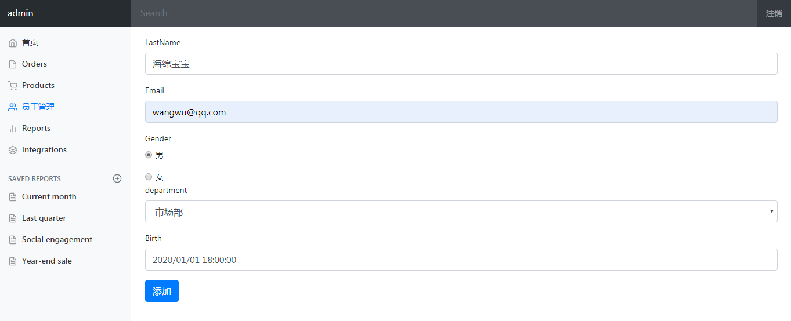
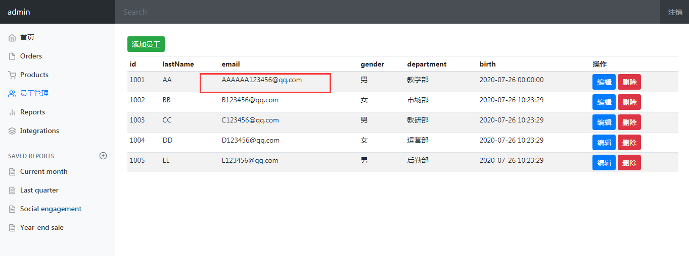
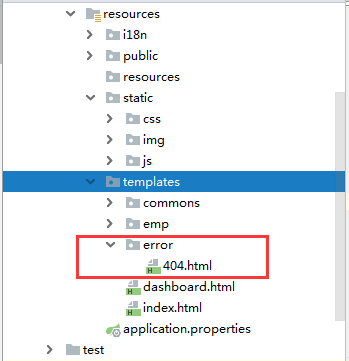

# 准备工作

1、前端页面的放置

- 将html页面放入templates目录

- 将css，js，img放入到static目录

  

2、实体类的编写

- Department

  ```java
  //部门表
  @Data
  @AllArgsConstructor
  @NoArgsConstructor
  public class Department {
      private Integer id;
      private String departmentName;
  }
  ```

- Employee

  ```java
  //员工表
  @Data
  @NoArgsConstructor
  public class Employee {
      private Integer id;
      private String lastName;
      private String email;
      private Integer gender; //0:女，1：男
  
      private Department department;
      private Date birth;
  
      public Employee(Integer id, String lastName, String email, Integer gender, Department department) {
          this.id = id;
          this.lastName = lastName;
          this.email = email;
          this.gender = gender;
          this.department = department;
          //默认的创建日期
          this.birth = new Date();
      }
  }
  ```

3、dao层模拟数据库

- DepartmentDao

  ```java
  //部门Dao
  @Repository
  public class DepartmentDao {
  
      //模拟数据库数据
  
      private static Map<Integer, Department> departments = null;
  
      static {
          departments = new HashMap<Integer, Department>();//创建一个部门表
  
          departments.put(101,new Department(101,"教学部"));
          departments.put(102,new Department(102,"市场部"));
          departments.put(103,new Department(103,"教研部"));
          departments.put(104,new Department(104,"运营部"));
          departments.put(105,new Department(105,"后勤部"));
      }
  
      //获得所有部门信息
      public Collection<Department> getDepartment() {
          return departments.values();
      }
  
      //通过id得到部门
      public Department getDepartmentById(Integer id) {
          return departments.get(id);
      }
  }
  ```

- EmployeeDao

  ```java
  //员工Dao
  @Repository
  public class EmployeeDao {
  
      //模拟数据库数据
      private static Map<Integer, Employee> employees = null;
      //员工所属部门
      @Autowired
      private DepartmentDao departmentDao;
  
      static {
          employees = new HashMap<Integer, Employee>();//创建一个员工表
  
          employees.put(1001,new Employee(1001,"AA","A123456@qq.com",1,new Department(101,"教学部")));
          employees.put(1002,new Employee(1002,"BB","B123456@qq.com",0,new Department(102,"市场部")));
          employees.put(1003,new Employee(1003,"CC","C123456@qq.com",1,new Department(103,"教研部")));
          employees.put(1004,new Employee(1004,"DD","D123456@qq.com",0,new Department(104,"运营部")));
          employees.put(1005,new Employee(1005,"EE","E123456@qq.com",1,new Department(105,"后勤部")));
      }
  
      //主键自增
      private static Integer ininId = 1006;
  
      //增加一个员工
      public void save(Employee employee) {
          if (employee.getId() == null) {
              employee.setId(ininId++);
          }
          employee.setDepartment(departmentDao.getDepartmentById(employee.getDepartment().getId()));
  
          employees.put(employee.getId(),employee);
      }
  
      // 查询全部员工信息
      public Collection<Employee> getAll() {
          return employees.values();
      }
  
      // 通过id查询员工
      public Employee getEmployeeById(Integer id) {
          return employees.get(id);
      }
  
      //删除员工通过id
      public void delete(Integer id) {
          employees.remove(id);
      }
  }
  ```

4、目录结构


# 首页实现

## 第一种方式

创建一个`IndexController`,写一个返回首页的方法（<font color=red>不建议使用</font>）

```java
@Controller
public class IndexController{
    @RequestMapping({"/","/index.html"})
    public String index() {
        return "index";
    }
}
```

## 第二种方式

创建一个`config`目录，在里面写一个`MyMvcConfig`,里面重写`addViewControllers`方法

```java
@Configuration
public class MyMvcConfig implements WebMvcConfigurer{
    @Override
    public void addViewControllers(ViewControllerRegistry registry) {
        registry.addViewController("/").setViewName("index");
        registry.addViewController("/index.html").setViewName("index");
}
```

首页页面展示：


## 加载静态资源

1、导入thymeleaf包

```html
<html lang="en" xmlns:th="http://www.thymeleaf.org">
```

2、将所有页面的静态资源使用thymeleaf接管

```html
<!-- css的导入 -->
<link th:href="@{/css/bootstrap.min.css}" rel="stylesheet">
<link th:href="@{/css/signin.css}" rel="stylesheet">

<!-- 图片的导入 -->


<!-- js导入 -->
<script type="text/javascript" th:src="@{/js/jquery-3.2.1.slim.min.js}"></script>
<script type="text/javascript" th:src="@{/js/popper.min.js}"></script>
<script type="text/javascript" th:src="@{/js/bootstrap.min.js}"></script>

<script type="text/javascript" th:src="@{/js/feather.min.js}"></script>

<script type="text/javascript" th:src="@{/js/Chart.min.js}"></script>
```

静态资源目录


再次看一下首页页面


# 页面国际化

见页面国际化：[]()

# 登录页面

1、首页登录页面表单的修改

```html
<form class="form-signin" th:action="@{/user/login}">
    ......
    <!--如果msg的消息不为空，则显示这个消息-->
    <p style="color: red" th:text="${msg}" th:if="${not #strings.isEmpty({msg})}"></p>
    <input type="text" name="username" class="form-control" th:placeholder="#{login.username}" required="" autofocus="">
    <input type="password" name="password" class="form-control" th:placeholder="#{login.password}" required="">
	......
</form>        
```

<font color=red>注意：</font>登录失败时的信息显示的书写（第4行内容）

2、写一个LoginController登录验证

```java
@Controller
public class LoginController {

    @RequestMapping("/user/login")
    public String login(@RequestParam("username") String username,
                        @RequestParam("password")String password,
                        Model model,
                        HttpSession session) {
        //具体的业务,登录成功跳转到dashboard页面
        if (!StringUtils.isEmpty(username) && "123456".equals(password)) {
            return "dashboard";
        } else {
            model.addAttribute("msg","用户名或者密码错误");
            return "index";
        }
    }
}
```

登录成功页面


登录失败页面


3、登录页面不友好（密码泄露）


4、解决3的密码泄露问题

- 加一个main映射在`MyMvcConfig`中（第6行）

    ```java
    public class MyMvcConfig implements WebMvcConfigurer{
        @Override
        public void addViewControllers(ViewControllerRegistry registry) {
            registry.addViewController("/").setViewName("index");
            registry.addViewController("/index.html").setViewName("index");
            registry.addViewController("/main.html").setViewName("dashboard");
        }
    }
    ```

- 修改`LoginController`跳转页面代码(redirect跳转)

  ```java
  @RequestMapping("/user/login")
  public String login(@RequestParam("username") String username,
                      @RequestParam("password")String password,
                      Model model) {
      //具体的业务,登录成功跳转到dashboard页面
      if (!StringUtils.isEmpty(username) && "123456".equals(password)) {
          return "redirect:/main.html";
      } else {
          model.addAttribute("msg","用户名或者密码错误");
          return "index";
      }
  }
  ```

  

5、是否存在问题？(登录成功才可以进入main页面，否则直接输入http://localhost:8080/main.html就可以访问首页了)，需要拦截器实现

# 登录拦截器

1、在`LoginController`中添加一个session判断登录（第11行）

```java
@Controller
public class LoginController {

    @RequestMapping("/user/login")
    public String login(@RequestParam("username") String username,
                        @RequestParam("password")String password,
                        Model model,
                        HttpSession session) {
        //具体的业务,登录成功跳转到dashboard页面
        if (!StringUtils.isEmpty(username) && "123456".equals(password)) {
            session.setAttribute("loginUser",username);
            return "redirect:/main.html";
        } else {
            model.addAttribute("msg","用户名或者密码错误");
            return "index";
        }
    }
}
```

2、在`config`页面写一个`LoginHandlerInterceptor`拦截器

```java
public class LoginHandlerInterceptor implements HandlerInterceptor {
    @Override
    public boolean preHandle(HttpServletRequest request, HttpServletResponse response, Object handler) throws Exception {

        // 登录成功之后，应该有用户的session
        Object loginUser = request.getSession().getAttribute("loginUser");

        if (loginUser == null) {
            request.setAttribute("msg","没有权限，请先登录");
            request.getRequestDispatcher("/index.html").forward(request,response);
            return false;
        } else {
            return true;
        }
    }
}
```

3、`MyMvcConfig`页面重写拦截器方法

```java
@Override
public void addInterceptors(InterceptorRegistry registry) {
    registry.addInterceptor(new LoginHandlerInterceptor())
        .addPathPatterns("/**")
        .excludePathPatterns("/index.html","/","/user/login","/css/**","/js/**","/img/**");
}
```

<font color=red>注意：</font>静态资源的过滤，否则页面渲染效果会消失

4、在dashboard.html页面修改登录信息为session`[[ ${session.loginUser} ]]`，登录成功之后会显示用户名

5、页面的展示


# 员工列表展示

## 后台编写

员工管理后台Controller编写

```java
@Controller
public class EmployeeController {
    
    @Autowired
    EmployeeDao employeeDao;

    @RequestMapping("/emps")
    public String list(Model model) {
        Collection<Employee> employees = employeeDao.getAll();
        model.addAttribute("emps",employees);
        return "emp/list";
    }
}

```

## 提取公共页面

1、员工管理前端页面地址的修改（list.html和dashboard.html）`@{/emps}`

```html
<li class="nav-item">
    <a class="nav-link" th:href="@{/emps}">
        ......
        员工管理
    </a>
</li>
```

2、抽取公共的代码（list.html和dashboard.html）

- dashboard.html页面

  ```html
  <!--顶部导航栏-->
  <nav class="navbar navbar-dark sticky-top bg-dark flex-md-nowrap p-0" th:fragment="topbar">
      <!--...-->
  </nav>
  
  <!--侧边栏-->
  <nav class="col-md-2 d-none d-md-block bg-light sidebar" th:fragment="sidebar">
     <!--...-->
  </nav>
  ```

- list.html

  ```html
  <!--顶部导航栏-->
  <div th:insert="~{dashboard::topbar}"></div>
  
  
  <!--侧边栏-->
  <div th:insert="~{dashboard::sidebar}"></div>
  ```

3、进一步抽取公共的代码

- 在`templates`目录下面创建`commons`目录，在`commons`目录下面创建`commons.html`放公共代码

  ```html
  <!--只写改变的代码-->
  
  <!DOCTYPE html>
  <html lang="en" xmlns:th="http://www.thymeleaf.org">
  
  <!--顶部导航栏-->
  <nav class="navbar navbar-dark sticky-top bg-dark flex-md-nowrap p-0" th:fragment="topbar">
      .............
  </nav>
  
  <!--侧边栏-->
  <nav class="col-md-2 d-none d-md-block bg-light sidebar" th:fragment="sidebar">
      <div class="sidebar-sticky">
          <ul class="nav flex-column">
              <li class="nav-item">
                  <a class="nav-link active" th:href="@{/index.html}">
                    	.............
                      首页 <span class="sr-only">(current)</span>
                  </a>
              </li>
              .............
              <li class="nav-item">
                  <a class="nav-link" th:href="@{/emps}">
                      .............
                      员工管理
                  </a>
              </li>
              .............
          </ul>
          .............
      </div>
  </nav>
  </html>
  ```

- dashboard.html和list.html页面一样

  ```html
  <!--顶部导航栏-->
  <div th:replace="~{commons/commons::topbar}"></div>
  
  <!--侧边栏-->
  <div th:replace="~{commons/commons::sidebar}"></div>
  ```

  <font color=red>注意</font>：replace和insert的效果一样，只不过insert会多套一层div

4、添加侧边栏点中高亮

- 在dashboard.html和list.html页面中侧边栏传参（在括号里面直接传参）

  ```html
  <!--侧边栏-->
  <div th:replace="~{commons/commons::sidebar(active='list.html')}"></div>
  ```

- 在commons.html中接收参数并判断

  ```html
  <!--侧边栏-->
  <nav class="col-md-2 d-none d-md-block bg-light sidebar" th:fragment="sidebar">
      <div class="sidebar-sticky">
          <ul class="nav flex-column">
              <li class="nav-item">
                 <a th:class="${active=='main.html'?'nav-link active':'nav-link'}" th:href="@{/main.html}">
  
                    	.............
                      首页 <span class="sr-only">(current)</span>
                  </a>
              </li>
              .............
              <li class="nav-item">
              	<a th:class="${active=='list.html'?'nav-link active':'nav-link'}" th:href="@{/emps}">
  
                      .............
                      员工管理
                  </a>
              </li>
              .............
          </ul>
          .............
      </div>
  </nav>
  </html>
  ```

## 列表循环展示

员工列表循环（list.html）

```html
<!--侧边栏-->
<div th:replace="~{commons/commons::sidebar(active='list.html')}"></div>

<main role="main" class="col-md-9 ml-sm-auto col-lg-10 pt-3 px-4">
    <h2>Section title</h2>
    <div class="table-responsive">
        <table class="table table-striped table-sm">
            <thead>
                <tr>
                    <th>id</th>
                    <th>lastName</th>
                    <th>email</th>
                    <th>gender</th>
                    <th>department</th>
                    <th>birth</th>
                    <th>操作</th>
                </tr>
            </thead>
            <tbody>
                <tr th:each="emp:${emps}">
                    <td th:text="${emp.getLastName()}"></td>
                    <td th:text="${emp.getEmail()}"></td>
                    <td th:text="${emp.getGender()==0?'女':'男'}"></td>
                    <td th:text="${emp.department.getDepartmentName()}"></td>
                    <td th:text="${#dates.format(emp.getBirth(),'yyyy-MM-dd HH:mm:ss')}"></td>
                    <td>
                        <button class="btn btn-sm btn-primary">编辑</button>
                        <button class="btn btn-sm btn-danger">删除</button>
                    </td>
                </tr>
            </tbody>
        </table>
    </div>
</main>
```

页面展示


# 添加员工信息

## 按钮提交

list.html页面编写

```html
<h2><a class="btn btn-sm btn-success" th:href="@{/emp}">添加员工</a></h2>
```

添加的位置


## 跳转到添加页面

1、后台页面的编写（跳转到add.html页面 ）

```java
@GetMapping("/emp")
public String toAddPage(Model model) {
    //查出所有部门的信息
    Collection<Department> department = departmentDao.getDepartment();
    model.addAttribute("departments",department);
    return "emp/add";
}
```

2、add.html页面的编写（其他部分和list.html页面一样，只改main中的代码即可）

```html
<main role="main" class="col-md-9 ml-sm-auto col-lg-10 pt-3 px-4">
    <form th:action="@{/emp}" method="post">
        <div class="form-group">
            <label>LastName</label>
            <input type="text" name="lastName" class="form-control" placeholder="海绵宝宝">
        </div>
        <div class="form-group">
            <label>Email</label>
            <input type="email" name="email" class="form-control" placeholder="1176244270@qq.com">
        </div>
        <div class="form-group">
            <label>Gender</label><br>
            <div class="form-check form-check-inline">
                <input class="form-check-input" type="radio" name="gender" value="1">
                <label class="form-check-label">男</label>
            </div>
        </div>
        <div class="form-check form-check-inline">
            <input class="form-check-input" type="radio" name="gender" value="0">
            <label class="form-check-label">女</label>
        </div>
        <div class="form-group">
            <label>department</label>
            <select class="form-control" name="department.id">
                <!--我们在controller接收的是一个Employee，所以我们需要提交的是其中的一个属性-->
                <option th:each="dept:${departments}" th:text="${dept.getDepartmentName()}" th:value="${dept.getId()}">1</option>
            </select>
        </div>
        <div class="form-group">
            <label>Birth</label>
            <input type="text" name="birth" class="form-control" placeholder="2020/07/25 18:00:00">
        </div>
        <button type="submit" class="btn btn-primary">添加</button>
    </form>
</main>
```

<font color=red>注意：</font>下拉框提交的时候应提交一个属性，因为其在controller接收的是一个Employee，否则会报错

页面：


## 添加员工成功

后台页面的编写

```java
@Autowired
DepartmentDao departmentDao;

@PostMapping("/emp")
public String addEmp(Employee employee) {
    employeeDao.save(employee);//调用底层业务方法保存员工信息
    return "redirect:/emps";
}
```

添加信息页面



添加成功页面


## 日期格式的修改

1、如果输入的日期格式为2020-01-01，则报错


2、application.properties文件中添加配置

- 2.2.x版本之前

  ```properties
  spring.mvc.date-format=yyyy-MM-dd
  ```

- 2.2.x版本之后

  ```properties
  spring.mvc.format.date=yyyy-MM-dd
  ```

# 修改员工信息

## 按钮提交

list.html页面编辑按钮的编写（’+‘ 报红别管）

```html
<a class="btn btn-sm btn-primary" th:href="@{/emp/}+${emp.getId()}">编辑</a>
```

## 跳转到修改页面

1、后台页面的接收参数（Restful风格）

```java
// 去到员工的修改页面
@GetMapping("/emp/{id}")
public String toUpdateEmp(@PathVariable("id") Integer id, Model model) {
    //查出原来的数据
    Employee employee = employeeDao.getEmployeeById(id);
    model.addAttribute("emp",employee);
    //查出所有部门的信息
    Collection<Department> department = departmentDao.getDepartment();
    model.addAttribute("departments",department);
    return "emp/update";
}
```

2、update.html页面（main里面修改，其他和list.html页面一样）

```html
<main role="main" class="col-md-9 ml-sm-auto col-lg-10 pt-3 px-4">
    <form th:action="@{/updateEmp}" method="post">
        <input type="hidden" name="id" th:value="${emp.getId()}">
        <div class="form-group">
            <label>LastName</label>
            <input th:value="${emp.getLastName()}" type="text" name="lastName" class="form-control" placeholder="海绵宝宝">
        </div>
        <div class="form-group">
            <label>Email</label>
            <input th:value="${emp.getEmail()}" type="email" name="email" class="form-control" placeholder="1176244270@qq.com">
        </div>
        <div class="form-group">
            <label>Gender</label><br>
            <div class="form-check form-check-inline">
                <input th:checked="${emp.getGender()==1}" class="form-check-input" type="radio" name="gender" value="1">
                <label class="form-check-label">男</label>
            </div>
        </div>
        <div class="form-check form-check-inline">
            <input th:checked="${emp.getGender()==0}" class="form-check-input" type="radio" name="gender" value="0">
            <label class="form-check-label">女</label>
        </div>
        <div class="form-group">
            <label>department</label>
            <select class="form-control" name="department.id">
                <!--我们在controller接收的是一个Employee，所以我们需要提交的是其中的一个属性-->
                <option th:selected="${dept.getId()==emp.getDepartment().getId()}" th:each="dept:${departments}" th:text="${dept.getDepartmentName()}" th:value="${dept.getId()}"></option>
            </select>
        </div>
        <div class="form-group">
            <label>Birth</label>
            <input th:value="${#dates.format(emp.getBirth(),'yyyy-MM-dd HH:mm:ss')}" type="text" name="birth" class="form-control" placeholder="2020-07-25 00:00:00">
        </div>
        <button type="submit" class="btn btn-primary">修改</button>
    </form>
</main>
```


## 修改员工成功

修改员工信息成功

```java
@PostMapping("/updateEmp")
public String updateEmp(Employee employee) {
    employeeDao.save(employee);
    return "redirect:/emps";
}
```




# 删除员工信息

## 按钮提交

list.html页面删除按钮的修改

```html
<a class="btn btn-sm btn-danger" th:href="@{/delemp/}+${emp.getId()}">删除</a>
```


## 接收参数删除用工信息

```java
// 删除员工
@GetMapping("/delemp/{id}")
public String deleteEmp(@PathVariable("id") Integer id) {
    employeeDao.delete(id);
    return "redirect:/emps";
}
```


# 404页面

将404.html页面放入到templates目录下面的error目录中



错误运行页面


# 注销功能的实现

1、在commons.html中修改注销按钮

```html
<a class="nav-link" th:href="@{/user/logout}">注销</a>
```

2、在`LoginController.java`中编写注销页面代码

```java
@RequestMapping("/user/logout")
public String logout(HttpSession session) {
    session.invalidate();
    return "redirect:/index.html";
}
```


# 如何写一个网站

1. 前端搞定：页面长什么样子
2. <font color=red>设计数据库（数据库设计难点）</font>
3. 前端让他能够自动运行，独立化工程
4. 数据接口如何对接：json，对象，all in one！
5. 前后端联调测试

模板：

1. 有一套自己熟悉的后台模板：工作必要！x-admin
2. 前端页面：至少自己能够通过前端框架，组合出来一个网站页面
   - index
   - about
   - blog
   - post
   - user
3. 让这个网站能够独立运行！