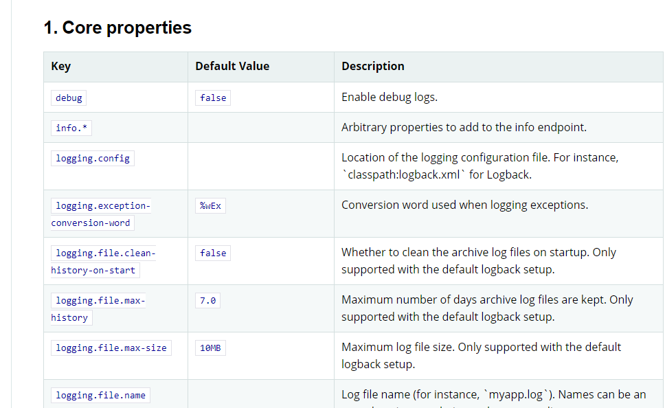
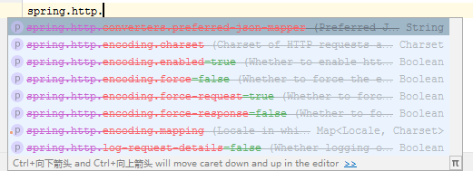

# 自动配置原理

配置文件到底能写什么？怎么写？<font color=red>----联系----</font> `spring.factories`

SpringBoot官方文档中有大量的配置，我们无法全部记住,官网：[https://docs.spring.io/spring-boot/docs/2.3.1.RELEASE/reference/html/appendix-application-properties.html#core-properties](https://docs.spring.io/spring-boot/docs/2.3.1.RELEASE/reference/html/appendix-application-properties.html#core-properties)



## 分析自动配置原理

1. SpringBoot启动的时候加载主配置类，开启了自动配置功能 @EnableAutoConfiguration

2. @EnableAutoConfiguration 作用

   - 利用EnableAutoConfigurationImportSelector给容器中导入一些组件

   - 可以查看selectImports()方法的内容,他返回了一个autoConfigurationEnty,来自`this.getAutoConfigurationEntry(autoConfigurationMetadata,annotationMetadata);`这个方法我们继续来跟踪：

   - 这个方法有一个值：`List<String> configurations = getCandidateConfigurations(annotationMetadata, attributes);`叫做获取候选的配置 ，我们点击继续跟踪

     - `SpringFactoriesLoader.loadFactoryNames()`
     - 扫描所有jar包类路径下`META-INF/spring.factories`
     - 把扫描到的这些文件的内容包装成properties对象
     - 从properties中获取到EnableAutoConfiguration.class类（类名）对应的值，然后把他们添加在容器中

   - <font color=red>在类路径下,`META-INF/spring.factories`里面配置的所有EnableAutoConfiguration的值加入到容器中：</font>

     ```java
     # Initializers
     org.springframework.context.ApplicationContextInitializer=\
     org.springframework.boot.autoconfigure.SharedMetadataReaderFactoryContextInitializer,\
     org.springframework.boot.autoconfigure.logging.ConditionEvaluationReportLoggingListener
     
     # Application Listeners
     org.springframework.context.ApplicationListener=\
     org.springframework.boot.autoconfigure.BackgroundPreinitializer
     
     # Auto Configuration Import Listeners
     org.springframework.boot.autoconfigure.AutoConfigurationImportListener=\
     org.springframework.boot.autoconfigure.condition.ConditionEvaluationReportAutoConfigurationImportListener
     
     # Auto Configuration Import Filters
     org.springframework.boot.autoconfigure.AutoConfigurationImportFilter=\
     org.springframework.boot.autoconfigure.condition.OnBeanCondition,\
     org.springframework.boot.autoconfigure.condition.OnClassCondition,\
     org.springframework.boot.autoconfigure.condition.OnWebApplicationCondition
     
     # Auto Configure
     org.springframework.boot.autoconfigure.EnableAutoConfiguration=\
     org.springframework.boot.autoconfigure.admin.SpringApplicationAdminJmxAutoConfiguration,\
     org.springframework.boot.autoconfigure.aop.AopAutoConfiguration,\
     org.springframework.boot.autoconfigure.amqp.RabbitAutoConfiguration,\
     org.springframework.boot.autoconfigure.batch.BatchAutoConfiguration,\
     org.springframework.boot.autoconfigure.cache.CacheAutoConfiguration,\
     org.springframework.boot.autoconfigure.cassandra.CassandraAutoConfiguration,\
     org.springframework.boot.autoconfigure.context.ConfigurationPropertiesAutoConfiguration,\
     org.springframework.boot.autoconfigure.context.LifecycleAutoConfiguration,\
     org.springframework.boot.autoconfigure.context.MessageSourceAutoConfiguration,\
     org.springframework.boot.autoconfigure.context.PropertyPlaceholderAutoConfiguration,\
     org.springframework.boot.autoconfigure.couchbase.CouchbaseAutoConfiguration,\
     org.springframework.boot.autoconfigure.dao.PersistenceExceptionTranslationAutoConfiguration,\
     org.springframework.boot.autoconfigure.data.cassandra.CassandraDataAutoConfiguration,\
     org.springframework.boot.autoconfigure.data.cassandra.CassandraReactiveDataAutoConfiguration,\
     org.springframework.boot.autoconfigure.data.cassandra.CassandraReactiveRepositoriesAutoConfiguration,\
     org.springframework.boot.autoconfigure.data.cassandra.CassandraRepositoriesAutoConfiguration,\
     org.springframework.boot.autoconfigure.data.couchbase.CouchbaseDataAutoConfiguration,\
     org.springframework.boot.autoconfigure.data.couchbase.CouchbaseReactiveDataAutoConfiguration,\
     org.springframework.boot.autoconfigure.data.couchbase.CouchbaseReactiveRepositoriesAutoConfiguration,\
     org.springframework.boot.autoconfigure.data.couchbase.CouchbaseRepositoriesAutoConfiguration,\
     org.springframework.boot.autoconfigure.data.elasticsearch.ElasticsearchDataAutoConfiguration,\
     org.springframework.boot.autoconfigure.data.elasticsearch.ElasticsearchRepositoriesAutoConfiguration,\
     org.springframework.boot.autoconfigure.data.elasticsearch.ReactiveElasticsearchRepositoriesAutoConfiguration,\
     org.springframework.boot.autoconfigure.data.elasticsearch.ReactiveElasticsearchRestClientAutoConfiguration,\
     org.springframework.boot.autoconfigure.data.jdbc.JdbcRepositoriesAutoConfiguration,\
     org.springframework.boot.autoconfigure.data.jpa.JpaRepositoriesAutoConfiguration,\
     org.springframework.boot.autoconfigure.data.ldap.LdapRepositoriesAutoConfiguration,\
     org.springframework.boot.autoconfigure.data.mongo.MongoDataAutoConfiguration,\
     org.springframework.boot.autoconfigure.data.mongo.MongoReactiveDataAutoConfiguration,\
     org.springframework.boot.autoconfigure.data.mongo.MongoReactiveRepositoriesAutoConfiguration,\
     org.springframework.boot.autoconfigure.data.mongo.MongoRepositoriesAutoConfiguration,\
     org.springframework.boot.autoconfigure.data.neo4j.Neo4jDataAutoConfiguration,\
     org.springframework.boot.autoconfigure.data.neo4j.Neo4jRepositoriesAutoConfiguration,\
     org.springframework.boot.autoconfigure.data.solr.SolrRepositoriesAutoConfiguration,\
     org.springframework.boot.autoconfigure.data.r2dbc.R2dbcDataAutoConfiguration,\
     org.springframework.boot.autoconfigure.data.r2dbc.R2dbcRepositoriesAutoConfiguration,\
     org.springframework.boot.autoconfigure.data.r2dbc.R2dbcTransactionManagerAutoConfiguration,\
     org.springframework.boot.autoconfigure.data.redis.RedisAutoConfiguration,\
     org.springframework.boot.autoconfigure.data.redis.RedisReactiveAutoConfiguration,\
     org.springframework.boot.autoconfigure.data.redis.RedisRepositoriesAutoConfiguration,\
     org.springframework.boot.autoconfigure.data.rest.RepositoryRestMvcAutoConfiguration,\
     org.springframework.boot.autoconfigure.data.web.SpringDataWebAutoConfiguration,\
     org.springframework.boot.autoconfigure.elasticsearch.ElasticsearchRestClientAutoConfiguration,\
     org.springframework.boot.autoconfigure.flyway.FlywayAutoConfiguration,\
     org.springframework.boot.autoconfigure.freemarker.FreeMarkerAutoConfiguration,\
     org.springframework.boot.autoconfigure.groovy.template.GroovyTemplateAutoConfiguration,\
     org.springframework.boot.autoconfigure.gson.GsonAutoConfiguration,\
     org.springframework.boot.autoconfigure.h2.H2ConsoleAutoConfiguration,\
     org.springframework.boot.autoconfigure.hateoas.HypermediaAutoConfiguration,\
     org.springframework.boot.autoconfigure.hazelcast.HazelcastAutoConfiguration,\
     org.springframework.boot.autoconfigure.hazelcast.HazelcastJpaDependencyAutoConfiguration,\
     org.springframework.boot.autoconfigure.http.HttpMessageConvertersAutoConfiguration,\
     org.springframework.boot.autoconfigure.http.codec.CodecsAutoConfiguration,\
     org.springframework.boot.autoconfigure.influx.InfluxDbAutoConfiguration,\
     org.springframework.boot.autoconfigure.info.ProjectInfoAutoConfiguration,\
     org.springframework.boot.autoconfigure.integration.IntegrationAutoConfiguration,\
     org.springframework.boot.autoconfigure.jackson.JacksonAutoConfiguration,\
     org.springframework.boot.autoconfigure.jdbc.DataSourceAutoConfiguration,\
     org.springframework.boot.autoconfigure.jdbc.JdbcTemplateAutoConfiguration,\
     org.springframework.boot.autoconfigure.jdbc.JndiDataSourceAutoConfiguration,\
     org.springframework.boot.autoconfigure.jdbc.XADataSourceAutoConfiguration,\
     org.springframework.boot.autoconfigure.jdbc.DataSourceTransactionManagerAutoConfiguration,\
     org.springframework.boot.autoconfigure.jms.JmsAutoConfiguration,\
     org.springframework.boot.autoconfigure.jmx.JmxAutoConfiguration,\
     org.springframework.boot.autoconfigure.jms.JndiConnectionFactoryAutoConfiguration,\
     org.springframework.boot.autoconfigure.jms.activemq.ActiveMQAutoConfiguration,\
     org.springframework.boot.autoconfigure.jms.artemis.ArtemisAutoConfiguration,\
     org.springframework.boot.autoconfigure.jersey.JerseyAutoConfiguration,\
     org.springframework.boot.autoconfigure.jooq.JooqAutoConfiguration,\
     org.springframework.boot.autoconfigure.jsonb.JsonbAutoConfiguration,\
     org.springframework.boot.autoconfigure.kafka.KafkaAutoConfiguration,\
     org.springframework.boot.autoconfigure.availability.ApplicationAvailabilityAutoConfiguration,\
     org.springframework.boot.autoconfigure.ldap.embedded.EmbeddedLdapAutoConfiguration,\
     org.springframework.boot.autoconfigure.ldap.LdapAutoConfiguration,\
     org.springframework.boot.autoconfigure.liquibase.LiquibaseAutoConfiguration,\
     org.springframework.boot.autoconfigure.mail.MailSenderAutoConfiguration,\
     org.springframework.boot.autoconfigure.mail.MailSenderValidatorAutoConfiguration,\
     org.springframework.boot.autoconfigure.mongo.embedded.EmbeddedMongoAutoConfiguration,\
     org.springframework.boot.autoconfigure.mongo.MongoAutoConfiguration,\
     org.springframework.boot.autoconfigure.mongo.MongoReactiveAutoConfiguration,\
     org.springframework.boot.autoconfigure.mustache.MustacheAutoConfiguration,\
     org.springframework.boot.autoconfigure.orm.jpa.HibernateJpaAutoConfiguration,\
     org.springframework.boot.autoconfigure.quartz.QuartzAutoConfiguration,\
     org.springframework.boot.autoconfigure.r2dbc.R2dbcAutoConfiguration,\
     org.springframework.boot.autoconfigure.rsocket.RSocketMessagingAutoConfiguration,\
     org.springframework.boot.autoconfigure.rsocket.RSocketRequesterAutoConfiguration,\
     org.springframework.boot.autoconfigure.rsocket.RSocketServerAutoConfiguration,\
     org.springframework.boot.autoconfigure.rsocket.RSocketStrategiesAutoConfiguration,\
     org.springframework.boot.autoconfigure.security.servlet.SecurityAutoConfiguration,\
     org.springframework.boot.autoconfigure.security.servlet.UserDetailsServiceAutoConfiguration,\
     org.springframework.boot.autoconfigure.security.servlet.SecurityFilterAutoConfiguration,\
     org.springframework.boot.autoconfigure.security.reactive.ReactiveSecurityAutoConfiguration,\
     org.springframework.boot.autoconfigure.security.reactive.ReactiveUserDetailsServiceAutoConfiguration,\
     org.springframework.boot.autoconfigure.security.rsocket.RSocketSecurityAutoConfiguration,\
     org.springframework.boot.autoconfigure.security.saml2.Saml2RelyingPartyAutoConfiguration,\
     org.springframework.boot.autoconfigure.sendgrid.SendGridAutoConfiguration,\
     org.springframework.boot.autoconfigure.session.SessionAutoConfiguration,\
     org.springframework.boot.autoconfigure.security.oauth2.client.servlet.OAuth2ClientAutoConfiguration,\
     org.springframework.boot.autoconfigure.security.oauth2.client.reactive.ReactiveOAuth2ClientAutoConfiguration,\
     org.springframework.boot.autoconfigure.security.oauth2.resource.servlet.OAuth2ResourceServerAutoConfiguration,\
     org.springframework.boot.autoconfigure.security.oauth2.resource.reactive.ReactiveOAuth2ResourceServerAutoConfiguration,\
     org.springframework.boot.autoconfigure.solr.SolrAutoConfiguration,\
     org.springframework.boot.autoconfigure.task.TaskExecutionAutoConfiguration,\
     org.springframework.boot.autoconfigure.task.TaskSchedulingAutoConfiguration,\
     org.springframework.boot.autoconfigure.thymeleaf.ThymeleafAutoConfiguration,\
     org.springframework.boot.autoconfigure.transaction.TransactionAutoConfiguration,\
     org.springframework.boot.autoconfigure.transaction.jta.JtaAutoConfiguration,\
     org.springframework.boot.autoconfigure.validation.ValidationAutoConfiguration,\
     org.springframework.boot.autoconfigure.web.client.RestTemplateAutoConfiguration,\
     org.springframework.boot.autoconfigure.web.embedded.EmbeddedWebServerFactoryCustomizerAutoConfiguration,\
     org.springframework.boot.autoconfigure.web.reactive.HttpHandlerAutoConfiguration,\
     org.springframework.boot.autoconfigure.web.reactive.ReactiveWebServerFactoryAutoConfiguration,\
     org.springframework.boot.autoconfigure.web.reactive.WebFluxAutoConfiguration,\
     org.springframework.boot.autoconfigure.web.reactive.error.ErrorWebFluxAutoConfiguration,\
     org.springframework.boot.autoconfigure.web.reactive.function.client.ClientHttpConnectorAutoConfiguration,\
     org.springframework.boot.autoconfigure.web.reactive.function.client.WebClientAutoConfiguration,\
     org.springframework.boot.autoconfigure.web.servlet.DispatcherServletAutoConfiguration,\
     org.springframework.boot.autoconfigure.web.servlet.ServletWebServerFactoryAutoConfiguration,\
     org.springframework.boot.autoconfigure.web.servlet.error.ErrorMvcAutoConfiguration,\
     org.springframework.boot.autoconfigure.web.servlet.HttpEncodingAutoConfiguration,\
     org.springframework.boot.autoconfigure.web.servlet.MultipartAutoConfiguration,\
     org.springframework.boot.autoconfigure.web.servlet.WebMvcAutoConfiguration,\
     org.springframework.boot.autoconfigure.websocket.reactive.WebSocketReactiveAutoConfiguration,\
     org.springframework.boot.autoconfigure.websocket.servlet.WebSocketServletAutoConfiguration,\
     org.springframework.boot.autoconfigure.websocket.servlet.WebSocketMessagingAutoConfiguration,\
     org.springframework.boot.autoconfigure.webservices.WebServicesAutoConfiguration,\
     org.springframework.boot.autoconfigure.webservices.client.WebServiceTemplateAutoConfiguration
     
     # Failure analyzers
     org.springframework.boot.diagnostics.FailureAnalyzer=\
     org.springframework.boot.autoconfigure.diagnostics.analyzer.NoSuchBeanDefinitionFailureAnalyzer,\
     org.springframework.boot.autoconfigure.flyway.FlywayMigrationScriptMissingFailureAnalyzer,\
     org.springframework.boot.autoconfigure.jdbc.DataSourceBeanCreationFailureAnalyzer,\
     org.springframework.boot.autoconfigure.jdbc.HikariDriverConfigurationFailureAnalyzer,\
     org.springframework.boot.autoconfigure.r2dbc.ConnectionFactoryBeanCreationFailureAnalyzer,\
     org.springframework.boot.autoconfigure.session.NonUniqueSessionRepositoryFailureAnalyzer
     
     # Template availability providers
     org.springframework.boot.autoconfigure.template.TemplateAvailabilityProvider=\
     org.springframework.boot.autoconfigure.freemarker.FreeMarkerTemplateAvailabilityProvider,\
     org.springframework.boot.autoconfigure.mustache.MustacheTemplateAvailabilityProvider,\
     org.springframework.boot.autoconfigure.groovy.template.GroovyTemplateAvailabilityProvider,\
     org.springframework.boot.autoconfigure.thymeleaf.ThymeleafTemplateAvailabilityProvider,\
     org.springframework.boot.autoconfigure.web.servlet.JspTemplateAvailabilityProvider
     
     ```

     每一个这样的 xxxAutoConfiguration类都是容器中的一个**组件，都加入到容器中；用他们来做自动配置；**

3. 每一个自动配置类进行自动配置功能；

4. 我们以**HttpEncodingAutoConfiguration（Http编码自动配置）**为例解释自动配置原理；

    ```java
    //表示这是一个配置类，和以前编写的配置文件一样，也可以给容器中添加组件；
    @Configuration 
   
    //启动指定类的ConfigurationProperties功能；
      //进入这个HttpProperties查看，将配置文件中对应的值和HttpProperties绑定起来；
      //并把HttpProperties加入到ioc容器中
    @EnableConfigurationProperties({HttpProperties.class}) 
   
    //Spring底层@Conditional注解
      //根据不同的条件判断，如果满足指定的条件，整个配置类里面的配置就会生效；
      //这里的意思就是判断当前应用是否是web应用，如果是，当前配置类生效
    @ConditionalOnWebApplication(
        type = Type.SERVLET
    )
   
    //判断当前项目有没有这个类CharacterEncodingFilter；SpringMVC中进行乱码解决的过滤器；
    @ConditionalOnClass({CharacterEncodingFilter.class})
   
    //判断配置文件中是否存在某个配置：spring.http.encoding.enabled；
      //如果不存在，判断也是成立的
      //即使我们配置文件中不配置pring.http.encoding.enabled=true，也是默认生效的；
    @ConditionalOnProperty(
        prefix = "spring.http.encoding",
        value = {"enabled"},
        matchIfMissing = true
    )
   
    public class HttpEncodingAutoConfiguration {
        //他已经和SpringBoot的配置文件映射了
        private final Encoding properties;
        //只有一个有参构造器的情况下，参数的值就会从容器中拿
        public HttpEncodingAutoConfiguration(HttpProperties properties) {
            this.properties = properties.getEncoding();
        }
   
        //给容器中添加一个组件，这个组件的某些值需要从properties中获取
        @Bean
        @ConditionalOnMissingBean //判断容器没有这个组件？
        public CharacterEncodingFilter characterEncodingFilter() {
            CharacterEncodingFilter filter = new OrderedCharacterEncodingFilter();
            filter.setEncoding(this.properties.getCharset().name());
            filter.setForceRequestEncoding(this.properties.shouldForce(org.springframework.boot.autoconfigure.http.HttpProperties.Encoding.Type.REQUEST));
            filter.setForceResponseEncoding(this.properties.shouldForce(org.springframework.boot.autoconfigure.http.HttpProperties.Encoding.Type.RESPONSE));
            return filter;
        }
        //。。。。。。。
    }
    ```

**一句话总结 ：根据当前不同的条件判断，决定这个配置类是否生效！**

- 一但这个配置类生效；这个配置类就会给容器中添加各种组件；

- 这些组件的属性是从对应的properties类中获取的，这些类里面的每一个属性又是和配置文件绑定的；

- 所有在配置文件中能配置的属性都是在xxxxProperties类中封装着；

- 配置文件能配置什么就可以参照某个功能对应的这个属性类

  ```java
  //从配置文件中获取指定的值和bean的属性进行绑定
  @ConfigurationProperties(prefix = "spring.http") 
  public class HttpProperties {
      // .....
  }
  ```

我们去配置文件里面试试前缀，看提示！



**这就是自动装配的原理！**


## 精髓

1. SpringBoot启动会加载大量的自动配置类

2. 我们看我们需要的功能有没有在SpringBoot默认写好的自动配置类当中；

3. 我们再来看这个自动配置类中到底配置了哪些组件；（只要我们要用的组件存在在其中，我们就不需要再手动配置了）

4. 给容器中自动配置类添加组件的时候，会从properties类中获取某些属性。我们只需要在配置文件中指定这些属性的值即可；

   **xxxxAutoConfigurartion：自动配置类；**给容器中添加组件

   **xxxxProperties:封装配置文件中相关属性；**

## @Conditional

了解完自动装配的原理后，我们来关注一个细节问题，**自动配置类必须在一定的条件下才能生效；**

**@Conditional派生注解（<font color=red>Spring注解版原生的@Conditional作用</font>）**

作用：必须是@Conditional指定的条件成立，才给容器中添加组件，配置配里面的所有内容才生效；

| @Conditional扩展注解            | 作用(判断是否满足当前指定条件)                   |
| ------------------------------- | ------------------------------------------------ |
| @ConditionalOnJava              | 系统的java版本是否符合要求                       |
| @ConditionalOnJava              | 容器中存在指定Bean ;                             |
| @ConditionalOnMissingBean       | 容器中不存在指定Bean ;                           |
| @ConditionalOnExpression        | 满足SpEL表达式指定                               |
| @ConditionalOnClass             | 系统中有指定的类                                 |
| @ConditionalOnMissingClass      | 系统中没有指定的类                               |
| @ConditionalOnSingleCandidate   | 容器中只有一个指定的Bean ,或者这个Bean是首选Bean |
| @ConditionalOnProperty          | 系统中指定的属性是否有指定的值                   |
| @ConditionalOnResource          | 类路径下是否存在指定资源文件                     |
| @ConditionalOnWebApplication    | 当前是web环境                                    |
| @ConditionalOnNotWebApplication | 当前不是web环境                                  |
| @ConditionalOnJndi              | JNDI存在指定项                                   |


**那么多的自动配置类，必须在一定的条件下才能生效；也就是说，我们加载了这么多的配置类，但不是所有的都生效了。**

## 自动配置类是否生效

**我们可以在application.properties通过启用 `debug=true`属性；**

**在控制台打印自动配置报告，这样我们就可以很方便的知道哪些自动配置类生效；**

```yaml
#开启springboot的调试类
debug=true 
```

- **Positive matches:（自动配置类启用的：正匹配）**

- **Negative matches:（没有启动，没有匹配成功的自动配置类：负匹配）**

- **Unconditional classes: （没有条件的类）**

- **【演示：查看输出的日志】**