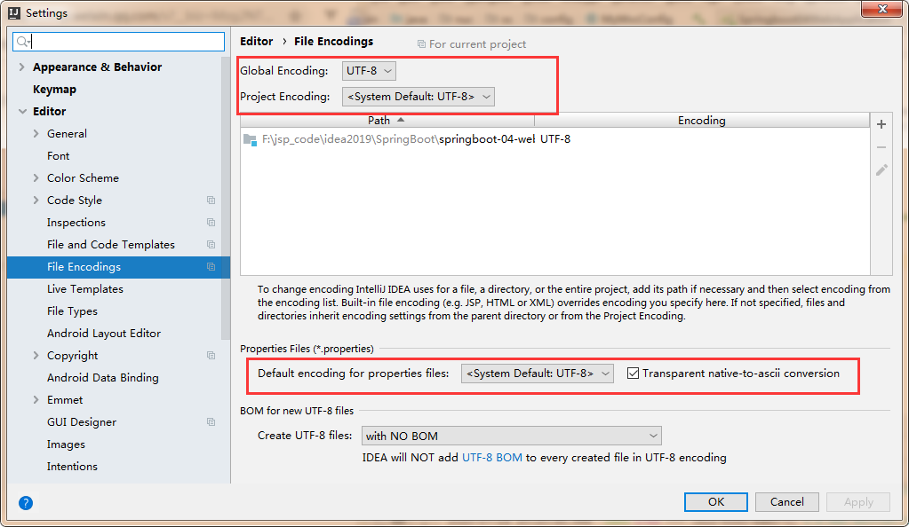
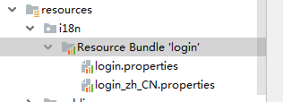
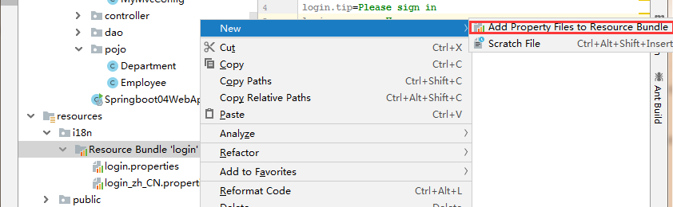
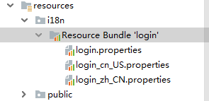
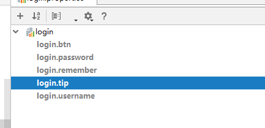
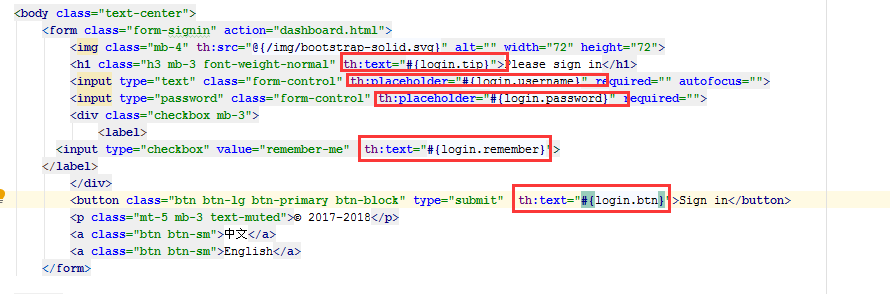
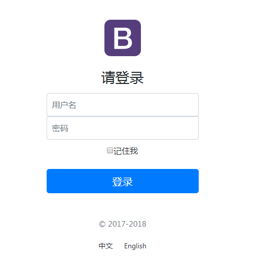

# 页面国际化

有的时候，我们的网站会去涉及中英文甚至多语言的切换，这时候我们就需要学习国际化了！

## 准备工作

先在IDEA中统一设置properties的编码问题！



编写国际化配置文件，抽取页面需要显示的国际化页面消息。我们可以去登录页面查看一下，哪些内容我们需要编写国际化的配置！

## 配置文件编写

1. 我们在resources资源文件下新建一个i18n（internationalization缩写）目录，存放国际化配置文件

2. 建立一个`login.properties`文件，还有一个`login_zh_CN.properties`；发现IDEA自动识别了我们要做国际化操作；文件夹变了！

   

3. 我们可以在这上面去新建一个文件；

   

   弹出如下页面：我们再添加一个英文的；

   

   这样就快捷多了！

   

4. **接下来，我们就来编写配置，我们可以看到idea下面有另外一个视图；**

   

   这个视图我们点击 + 号就可以直接添加属性了；我们新建一个login.tip，可以看到边上有三个文件框可以输入

   

   然后依次添加其他页面内容即可！

   

   然后去查看我们的配置文件；

   login.properties ：

   默认
   
    ```shell
    login.btn=登录
    login.password=密码
    login.remember=记住我
    login.tip=请登录
    login.username=用户名
    ```
   
   英文：
   
   ```shell
   login.btn=Sign in
   login.password=Password
   login.remember=Remember me
   login.tip=Please sign in
   login.username=Username
   ```
   
   中文：
   
   ```shell
   login.btn=登录
   login.password=密码
   login.remember=记住我
   login.tip=请登录
   login.username=用户名
   ```
   
   OK，配置文件步骤搞定！

## 配置文件生效探究

我们去看一下SpringBoot对国际化的自动配置！这里又涉及到一个类：`MessageSourceAutoConfiguration`

里面有一个方法，这里发现SpringBoot已经自动配置好了管理我们国际化资源文件的组件 `ResourceBundleMessageSource`；

```java
// 获取 properties 传递过来的值进行判断
@Bean
public MessageSource messageSource(MessageSourceProperties properties) {
    ResourceBundleMessageSource messageSource = new ResourceBundleMessageSource();
    if (StringUtils.hasText(properties.getBasename())) {
        // 设置国际化文件的基础名（去掉语言国家代码的）
        messageSource.setBasenames(
            StringUtils.commaDelimitedListToStringArray(
                                       StringUtils.trimAllWhitespace(properties.getBasename())));
    }
    if (properties.getEncoding() != null) {
        messageSource.setDefaultEncoding(properties.getEncoding().name());
    }
    messageSource.setFallbackToSystemLocale(properties.isFallbackToSystemLocale());
    Duration cacheDuration = properties.getCacheDuration();
    if (cacheDuration != null) {
        messageSource.setCacheMillis(cacheDuration.toMillis());
    }
    messageSource.setAlwaysUseMessageFormat(properties.isAlwaysUseMessageFormat());
    messageSource.setUseCodeAsDefaultMessage(properties.isUseCodeAsDefaultMessage());
    return messageSource;
}
```

我们真实 的情况是放在了i18n目录下，所以我们要去配置这个messages的路径；

```properties
spring.messages.basename=i18n.login
```

## 配置页面国际化值

去页面获取国际化的值，查看Thymeleaf的文档，找到message取值操作为：#{...}。我们去页面测试下：

IDEA还有提示，非常智能的！



我们可以去启动项目，访问一下，发现已经自动识别为中文的了！



**但是我们想要更好！可以根据按钮自动切换中文英文！**

## 配置国际化解析

在Spring中有一个国际化的Locale （区域信息对象）；里面有一个叫做`LocaleResolver `（获取区域信息对象）的解析器！

我们去我们webmvc自动配置文件，寻找一下！看到SpringBoot默认配置：

```java
@Bean
@ConditionalOnMissingBean
@ConditionalOnProperty(prefix = "spring.mvc", name = "locale")
public LocaleResolver localeResolver() {
    // 容器中没有就自己配，有的话就用用户配置的
    if (this.mvcProperties.getLocaleResolver() == WebMvcProperties.LocaleResolver.FIXED) {
        return new FixedLocaleResolver(this.mvcProperties.getLocale());
    }
    // 接收头国际化分解
    AcceptHeaderLocaleResolver localeResolver = new AcceptHeaderLocaleResolver();
    localeResolver.setDefaultLocale(this.mvcProperties.getLocale());
    return localeResolver;
}
```

`AcceptHeaderLocaleResolver` 这个类中有一个方法

```java
public Locale resolveLocale(HttpServletRequest request) {
    Locale defaultLocale = this.getDefaultLocale();
    // 默认的就是根据请求头带来的区域信息获取Locale进行国际化
    if (defaultLocale != null && request.getHeader("Accept-Language") == null) {
        return defaultLocale;
    } else {
        Locale requestLocale = request.getLocale();
        List<Locale> supportedLocales = this.getSupportedLocales();
        if (!supportedLocales.isEmpty() && !supportedLocales.contains(requestLocale)) {
            Locale supportedLocale = this.findSupportedLocale(request, supportedLocales);
            if (supportedLocale != null) {
                return supportedLocale;
            } else {
                return defaultLocale != null ? defaultLocale : requestLocale;
            }
        } else {
            return requestLocale;
        }
    }
}
```

那假如我们现在想点击链接让我们的国际化资源生效，就需要让我们自己的Locale生效！

我们去自己写一个自己的`LocaleResolver`，可以在链接上携带区域信息！

修改一下前端页面的跳转连接：

```html
<!-- 这里传入参数不需要使用 ？使用 （key=value）-->
<a class="btn btn-sm" th:href="@{/index.html(l='zh_CN')}">中文</a>
<a class="btn btn-sm" th:href="@{/index.html(l='en_US')}">English</a>
```

我们去写一个处理的组件类！

   ```java
package nuc.ss.component;

import org.springframework.util.StringUtils;
import org.springframework.web.servlet.LocaleResolver;

import javax.servlet.http.HttpServletRequest;
import javax.servlet.http.HttpServletResponse;
import java.util.Locale;

//可以在链接上携带区域信息
public class MyLocaleResolver implements LocaleResolver {

    //解析请求
    @Override
    public Locale resolveLocale(HttpServletRequest request) {

        String language = request.getParameter("l");
        Locale locale = Locale.getDefault(); // 如果没有获取到就使用系统默认的
        //如果请求链接不为空
        if (!StringUtils.isEmpty(language)){
            //分割请求参数
            String[] split = language.split("_");
            //国家，地区
            locale = new Locale(split[0],split[1]);
        }
        return locale;
    }

    @Override
    public void setLocale(HttpServletRequest httpServletRequest, HttpServletResponse httpServletResponse, Locale locale) {

    }
}
   ```

为了让我们的区域化信息能够生效，我们需要再配置一下这个组件！在我们自己的`MvcConofig`下添加`bean`；

```java
@Bean
public LocaleResolver localeResolver(){
    return new MyLocaleResolver();
}
```

**我们重启项目，来访问一下，发现点击按钮可以实现成功切换！搞定收工！**


## 小结：

1. 首页配置：
   - 注意点，所有页面的静态资源都需要使用thymeleaf接管
   - url:@{}
2. 页面国际化
   - 我们需要配置i18n文件
   - 我们如果需要在项目中进行按钮自动切换，我们需要定义一个组件`LocalResolver`
   - 记得将自己写的组件配置到spring容器`@Bean`
   - #{}

