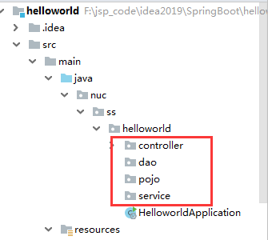
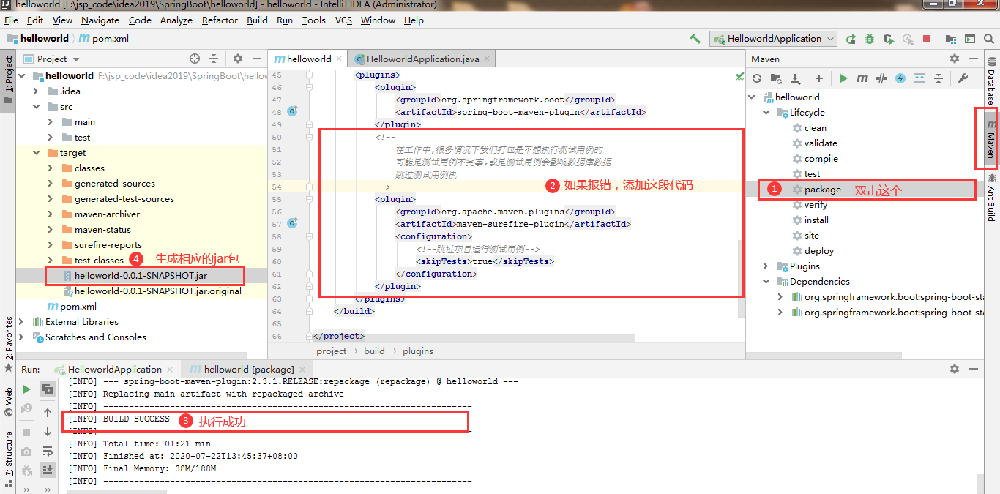
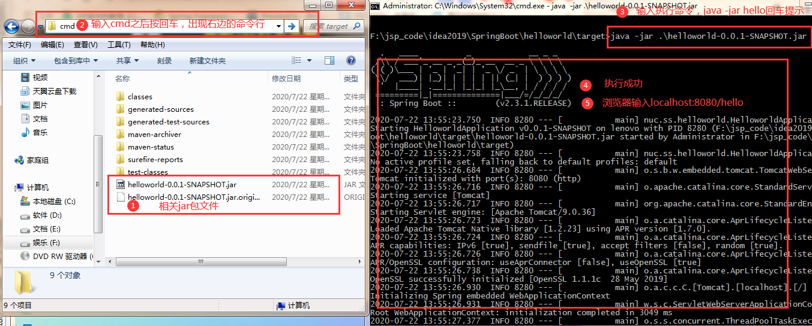
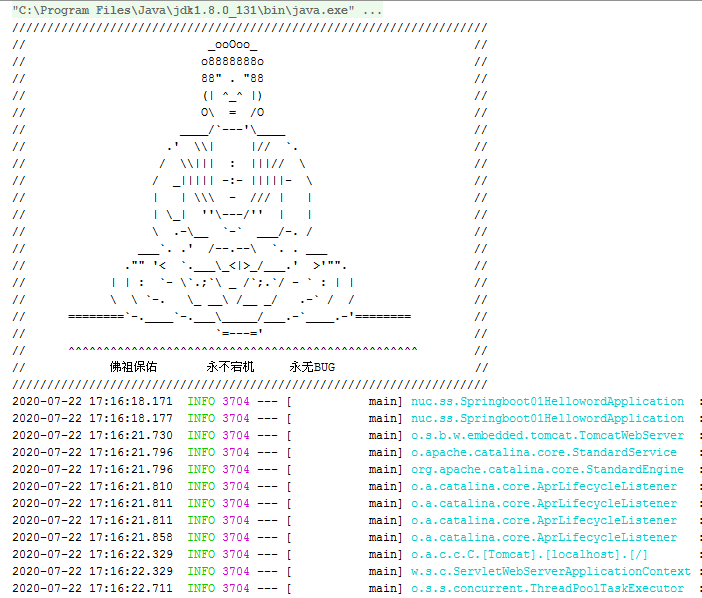

# 1、SpringBoot简介

## 回顾什么是Spring

- Spring是一个开源框架，2003 年兴起的一个轻量级的Java 开发框架，作者：Rod Johnson  。

- **Spring是为了解决企业级应用开发的复杂性而创建的，简化开发。**


## Spring是如何简化Java开发的

为了降低Java开发的复杂性，Spring采用了以下4种关键策略：

1、基于POJO的轻量级和最小侵入性编程，所有东西都是bean；

2、通过IOC，依赖注入（DI）和面向接口实现松耦合；

3、基于切面（AOP）和惯例进行声明式编程；

4、通过切面和模版减少样式代码，RedisTemplate，xxxTemplate；


## 什么是SpringBoot

- 学过javaweb的同学就知道，开发一个web应用，从最初开始接触Servlet结合Tomcat, 跑出一个Hello Wolrld程序，是要经历特别多的步骤；后来就用了框架Struts，再后来是SpringMVC，到了现在的SpringBoot，过一两年又会有其他web框架出现；你们有经历过框架不断的演进，然后自己开发项目所有的技术也在不断的变化、改造吗？建议都可以去经历一遍；

- 言归正传，什么是SpringBoot呢，就是一个javaweb的开发框架，和SpringMVC类似，对比其他javaweb框架的好处，官方说是简化开发，约定大于配置，  you can "just run"，能迅速的开发web应用，几行代码开发一个http接口。

- 所有的技术框架的发展似乎都遵循了一条主线规律：从一个复杂应用场景 衍生 一种规范框架，人们只需要进行各种配置而不需要自己去实现它，这时候强大的配置功能成了优点；发展到一定程度之后，人们根据实际生产应用情况，选取其中实用功能和设计精华，重构出一些轻量级的框架；之后为了提高开发效率，嫌弃原先的各类配置过于麻烦，于是开始提倡“约定大于配置”，进而衍生出一些一站式的解决方案。

- 是的这就是Java企业级应用->J2EE->spring->springboot的过程。

- 随着 Spring 不断的发展，涉及的领域越来越多，项目整合开发需要配合各种各样的文件，慢慢变得不那么易用简单，违背了最初的理念，甚至人称配置地狱。Spring Boot 正是在这样的一个背景下被抽象出来的开发框架，目的为了让大家更容易的使用 Spring 、更容易的集成各种常用的中间件、开源软件；

- Spring Boot 基于 Spring 开发，Spirng Boot 本身并不提供 Spring 框架的核心特性以及扩展功能，只是用于快速、敏捷地开发新一代基于 Spring 框架的应用程序。也就是说，它并不是用来替代 Spring 的解决方案，而是和 Spring 框架紧密结合用于提升 Spring 开发者体验的工具。Spring Boot 以**约定大于配置的核心思想**，默认帮我们进行了很多设置，多数 Spring Boot 应用只需要很少的 Spring 配置。同时它集成了大量常用的第三方库配置（例如 Redis、MongoDB、Jpa、RabbitMQ、Quartz 等等），Spring Boot 应用中这些第三方库几乎可以零配置的开箱即用。

- 简单来说就是SpringBoot其实不是什么新的框架，它默认配置了很多框架的使用方式，就像maven整合了所有的jar包，spring boot整合了所有的框架 。

- Spring Boot 出生名门，从一开始就站在一个比较高的起点，又经过这几年的发展，生态足够完善，Spring Boot 已经当之无愧成为 Java 领域最热门的技术。

**Spring Boot的主要优点：**

- 为所有Spring开发者更快的入门
- **开箱即用**，提供各种默认配置来简化项目配置
- 内嵌式容器简化Web项目
- 没有冗余代码生成和XML配置的要求

真的很爽，我们快速去体验开发个接口的感觉吧！


# 2、第一个SpringBoot程序

## 2.1、准备工作

我们将学习如何快速的创建一个Spring Boot应用，并且实现一个简单的Http请求处理。通过这个例子对Spring Boot有一个初步的了解，并体验其结构简单、开发快速的特性。

我的环境准备：

- jdk1.8
- Maven-3.6.1
- SpringBoot 最新版

- IDEA

## 2.2、创建基础项目说明

Spring官方提供了非常方便的工具让我们快速构建应用

Spring Initializr：https://start.spring.io/

**项目创建方式一：**在官网使用Spring Initializr 的 Web页面创建项目

1、打开  https://start.spring.io/

2、填写项目信息

3、点击”Generate Project“按钮生成项目；下载此项目

4、解压项目包，并用IDEA以Maven项目导入，一路下一步即可，直到项目导入完毕。

5、如果是第一次使用，可能速度会比较慢，包比较多、需要耐心等待一切就绪。


**项目创建方式二：**使用 IDEA 直接创建项目

1、创建一个新项目

2、选择spring initalizr ， 可以看到默认就是去官网的快速构建工具那里实现

3、填写项目信息

4、选择初始化的组件（初学勾选 Web 即可）

5、填写项目路径

6、等待项目构建成功


**项目结构分析：**

通过上面步骤完成了基础项目的创建。就会自动生成以下文件。

1、程序的主启动类

2、一个 application.properties 配置文件

3、一个 测试类

4、一个 pom.xml


## 2.3、pom.xml 分析

打开pom.xml，看看Spring Boot项目的依赖：

```xml
<!-- 父依赖 -->
<parent>
    <groupId>org.springframework.boot</groupId>
    <artifactId>spring-boot-starter-parent</artifactId>
    <version>2.2.5.RELEASE</version>
    <relativePath/>
</parent>

<dependencies>
    <!-- web场景启动器 -->
    <!--web依赖：tomcat,dispatcherServlet，xml...-->
    <dependency>
        <groupId>org.springframework.boot</groupId>
        <artifactId>spring-boot-starter-web</artifactId>
    </dependency>
    <!--spring-boot-starter：所有的springboot依赖都是使用这个开头的-->
    <!-- springboot单元测试 -->
    <dependency>
        <groupId>org.springframework.boot</groupId>
        <artifactId>spring-boot-starter-test</artifactId>
        <scope>test</scope>
        <!-- 剔除依赖 -->
        <exclusions>
            <exclusion>
                <groupId>org.junit.vintage</groupId>
                <artifactId>junit-vintage-engine</artifactId>
            </exclusion>
        </exclusions>
    </dependency>
</dependencies>

<build>
    <plugins>
        <!-- 打包插件 -->
        <plugin>
            <groupId>org.springframework.boot</groupId>
            <artifactId>spring-boot-maven-plugin</artifactId>
        </plugin>
    </plugins>
</build>
```

如上所示，主要有四个部分：

- 项目元数据：创建时候输入的Project Metadata部分，也就是Maven项目的基本元素，包括：groupId、artifactId、version、name、description等

- parent：继承`spring-boot-starter-parent`的依赖管理，控制版本与打包等内容

- dependencies：项目具体依赖，这里包含了`spring-boot-starter-web`用于实现HTTP接口（该依赖中包含了Spring MVC），官网对它的描述是：使用Spring MVC构建Web（包括RESTful）应用程序的入门者，使用Tomcat作为默认嵌入式容器。`spring-boot-starter-test`用于编写单元测试的依赖包。更多功能模块的使用将在后面逐步展开。

- build：构建配置部分。默认使用了`spring-boot-maven-plugin`，配合`spring-boot-starter-parent`就可以把Spring Boot应用打包成JAR来直接运行。

## 2.4、编写一个http接口

1、在主程序的同级目录下，新建一个controller包，一定要在同级目录下，否则识别不到



2、在包中新建一个HelloController类

```java
@RestController
public class HelloController {

    @RequestMapping("/hello")
    public String hello() {
        return "Hello World";
    }
    
}
```

3、编写完毕后，从主程序启动项目，浏览器发起请求，看页面返回；控制台输出了 Tomcat 访问的端口号！


简单几步，就完成了一个web接口的开发，SpringBoot就是这么简单。所以我们常用它来建立我们的微服务项目！


## 2.5、将项目打成jar包，点击 maven的 package

- 如果打包成功，则会在target目录下生成一个 jar 包

  

- 如果遇到以上②的错误，可以配置打包时跳过项目运行测试用例

    ```xml
    <!--
        在工作中,很多情况下我们打包是不想执行测试用例的
        可能是测试用例不完事,或是测试用例会影响数据库数据
        跳过测试用例执
    -->
    <plugin>
        <groupId>org.apache.maven.plugins</groupId>
        <artifactId>maven-surefire-plugin</artifactId>
        <configuration>
            <!--跳过项目运行测试用例-->
            <skipTests>true</skipTests>
        </configuration>
    </plugin>
    ```

- 打成了jar包后，就可以在任何地方运行了！OK

  

  浏览器运行结果（上图第⑤步）：

  


# **3、彩蛋**

1. 更改端口号

   ```properties
   # 更改项目的端口号
   server.port=8081
   ```

2. 如何更改启动时显示的字符拼成的字母，SpringBoot呢？也就是 banner 图案；

   只需一步：到项目下的 resources 目录下新建一个banner.txt 即可。

   图案可以到：https://www.bootschool.net/ascii 这个网站生成，然后拷贝到文件中即可！

​		

SpringBoot这么简单的东西背后一定有故事，我们之后去进行一波源码分析！


## SpringBoot系列全部笔记在“SpringBoot课堂笔记”文件夹中

