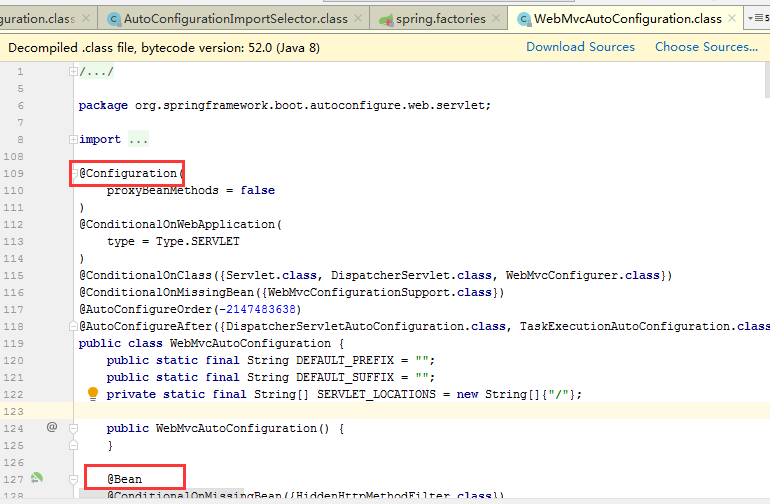

# 运行原理探究

我们之前写的HelloSpringBoot，到底是怎么运行的呢，Maven项目，我们一般从pom.xml文件探究起；

## 1、父依赖

> **pom.xml**

- spring-boot-dependencies：核心依赖在父工程中！
- 我们在写或者引入一些Springboot依赖的时候，不需要指定版本，就因为有这些版本仓库

1、其中它主要是依赖一个父项目，主要是管理项目的资源过滤及插件！

```xml
<parent>
    <groupId>org.springframework.boot</groupId>
    <artifactId>spring-boot-starter-parent</artifactId>
    <version>2.3.1.RELEASE</version>
    <relativePath/> 
    <!-- lookup parent from repository -->
</parent>
```

2、点进去，发现还有一个父依赖

```xml
<parent>
    <groupId>org.springframework.boot</groupId>
    <artifactId>spring-boot-dependencies</artifactId>
    <version>2.3.1.RELEASE</version>
</parent>
```

3、这里才是真正管理SpringBoot应用里面所有依赖版本的地方，SpringBoot的版本控制中心；

**4、以后我们导入依赖默认是不需要写版本；但是如果导入的包没有在依赖中管理着就需要手动配置版本了；**

## 2、启动器 spring-boot-starter

- 依赖
	```xml
  <dependency>        								 <groupId>org.springframework.boot</groupId>
       <artifactId>spring-boot-starter</artifactId>
  </dependency>
  ```

- **springboot-boot-starter-xxx**，说白了就是Springboot的启动场景

- 比如**spring-boot-starter-web**，他就会帮我们自动导入web的所有依赖

- springboot会将所有的功能场景，都变成一个个的启动器

- 我们要使用什么功能，就只需要找到对应的启动器就好了`start`

## 3、主程序

### 3.1、默认的主启动类

```java
//@SpringBootApplication 来标注一个主程序类
//说明这是一个Spring Boot应用
@SpringBootApplication
public class SpringbootApplication {
   public static void main(String[] args) {
     //以为是启动了一个方法，没想到启动了一个服务
      SpringApplication.run(SpringbootApplication.class, args);
   }
}
```

但是**一个简单的启动类并不简单！**我们来分析一下这些注解都干了什么

### 3.2、注解（@SpringBootApplication）

- 作用：标注在某个类上说明这个类是SpringBoot的主配置
- SpringBoot就应该运行这个类的main方法来启动SpringBoot应用；

- 进入这个注解：可以看到上面还有很多其他注解！

    ```java
    @SpringBootConfiguration
    @EnableAutoConfiguration
    @ComponentScan(
        excludeFilters = {@Filter(
        type = FilterType.CUSTOM,
        classes = {TypeExcludeFilter.class}
    ), @Filter(
        type = FilterType.CUSTOM,
        classes = {AutoConfigurationExcludeFilter.class}
    )}
    )
    public @interface SpringBootApplication {
        // ......
    }
    ```

#### @ComponentScan

- 这个注解在Spring中很重要 ,它对应XML配置中的元素。

- 作用：自动扫描并加载符合条件的组件或者bean ， 将这个bean定义加载到IOC容器中

#### @SpringBootConfiguration

- 作用：<font color=red>SpringBoot的配置类 </font>，标注在某个类上 ， 表示这是一个SpringBoot的配置类；

- 我们继续进去这个注解查看

    ```java
    // 点进去得到下面的 @Component
    @Configuration
    public @interface SpringBootConfiguration {}

    @Component
    public @interface Configuration {}
    ```

- 这里的 **@Configuration**，说明这是一个<font color=red>spring的配置类</font> ，配置类就是对应Spring的xml 配置文件；

- **@Component** 这就说明，启动类本身也是<font color=red>Spring中的一个组件</font>而已，负责启动应用！

- 我们回到 SpringBootApplication 注解中继续看。

#### @EnableAutoConfiguration

- **<font color=red>开启自动配置功能</font>**

  - 以前我们需要自己配置的东西，而现在SpringBoot可以自动帮我们配置 ；
  - @EnableAutoConfiguration告诉SpringBoot开启自动配置功能，这样自动配置才能生效；

  点进注解接续查看：

- **@AutoConfigurationPackage ：<font color=red>自动配置包</font>**

    ```java
    @Import({Registrar.class})
    public @interface AutoConfigurationPackage {
    }
    ```

    - **@import** ：Spring底层注解@import ， 给容器中导入一个组件

    - **Registrar.class** 作用：<font color=red>自动配置包注册</font>，将主启动类的所在包及包下面所有子包里面的所有组件扫描到Spring容器 ；

    - 这个分析完了，退到上一步，继续看

- **@Import({AutoConfigurationImportSelector.class}) ：给容器导入组件 ；**

  - **AutoConfigurationImportSelector** ：<font color=red>自动配置导入选择器</font>，那么它会导入哪些组件的选择器呢？我们点击去这个类看源码：

    ```java
  // 获取所有的配置
    List<String> configurations = this.getCandidateConfigurations(annotationMetadata, attributes);
    ```
  
  - 获得候选的配置
  
    ```java
    protected List<String> getCandidateConfigurations(AnnotationMetadata metadata, AnnotationAttributes attributes) {
        // 和下面的方法对应
        //这里的getSpringFactoriesLoaderFactoryClass（）方法
        //返回的就是我们最开始看的启动自动导入配置文件的注解类；EnableAutoConfiguration
      List<String> configurations = SpringFactoriesLoader.loadFactoryNames(this.getSpringFactoriesLoaderFactoryClass(), this.getBeanClassLoader());
        
      
        Assert.notEmpty(configurations, "No auto configuration classes found in META-INF/spring.factories. If you are using a custom packaging, make sure that file is correct.");
        return configurations;
    }
    
    //和上面的类的方法loadFactoryNames里面的第一个参数对应
    //这里的getSpringFactoriesLoaderFactoryClass（）方法
    //返回的就是我们最开始看的启动自动导入配置文件的注解类；EnableAutoConfiguration
   protected Class<?> getSpringFactoriesLoaderFactoryClass() {
         return EnableAutoConfiguration.class;
   }
    ```
  
  - 这个方法`getCandidateConfigurations()`又调用了  `SpringFactoriesLoader` 类的静态方法！我们进入`SpringFactoriesLoader`类loadFactoryNames() 方法，<font color=red>获取所有的加载配置</font>
  
    ```java
    public static List<String> loadFactoryNames(Class<?> factoryClass, @Nullable ClassLoader classLoader) {
        String factoryClassName = factoryClass.getName();
        //这里它又调用了 loadSpringFactories 方法
        return (List)loadSpringFactories(classLoader).getOrDefault(factoryClassName, Collections.emptyList());
    }
    ```
  
  - 我们继续点击查看 loadSpringFactories 方法
  
    - 项目资源:`META-INF/spring.factories`
    - 系统资源:`META-INF/spring.factories`
    - 从这些资源中配置了所有的nextElement（自动配置），分装成properties
  
    ```java
    //将所有的资源加载到配置类中（将下面的抽离出来分析，第15行）
    Properties properties = PropertiesLoaderUtils.loadProperties(resource);
    ```
  
    ```java
    private static Map<String, List<String>> loadSpringFactories(@Nullable ClassLoader classLoader) {
        //获得classLoader ， 我们返回可以看到这里得到的就是EnableAutoConfiguration标注的类本身
        MultiValueMap<String, String> result = (MultiValueMap)cache.get(classLoader);
        if (result != null) {
            return result;
        } else {
            try {
                //去获取一个资源 "META-INF/spring.factories"
                Enumeration<URL> urls = classLoader != null ? classLoader.getResources("META-INF/spring.factories") : ClassLoader.getSystemResources("META-INF/spring.factories");
                LinkedMultiValueMap result = new LinkedMultiValueMap();
                //判断有没有更多的元素，将读取到的资源循环遍历，封装成为一个Properties
                while(urls.hasMoreElements()) {
                  URL url = (URL)urls.nextElement();
                    UrlResource resource = new UrlResource(url);
                    Properties properties = PropertiesLoaderUtils.loadProperties(resource);
                    Iterator var6 = properties.entrySet().iterator();
                    while(var6.hasNext()) {
                        Entry<?, ?> entry = (Entry)var6.next();
                        String factoryClassName = ((String)entry.getKey()).trim();
                        String[] var9 = StringUtils.commaDelimitedListToStringArray((String)entry.getValue());
                        int var10 = var9.length;
                        for(int var11 = 0; var11 < var10; ++var11) {
                            String factoryName = var9[var11];
                            result.add(factoryClassName, factoryName.trim());
                        }
                    }
                }
                cache.put(classLoader, result);
                return result;
            } catch (IOException var13) {
                throw new IllegalArgumentException("Unable to load factories from location [META-INF/spring.factories]", var13);
            }
        }
    }
    ```
  
  - 发现一个多次出现的文件：spring.factories，全局搜索它


### 3.3、spring.factories

我们根据源头打开spring.factories ， 看到了很多自动配置的文件；这就是自动配置根源所在！


**WebMvcAutoConfiguration**

我们在上面的自动配置类随便找一个打开看看，比如 ：`WebMvcAutoConfiguration`



可以看到这些一个个的都是JavaConfig配置类，而且都注入了一些Bean，可以找一些自己认识的类，看着熟悉一下！

所以，自动配置真正实现是从classpath中搜寻所有的`META-INF/spring.factories`配置文件 ，并将其中对应的 `org.springframework.boot.autoconfigure`. 包下的配置项，通过反射实例化为对应标注了` @Configuration的JavaConfig`形式的IOC容器配置类 ， 然后将这些都汇总成为一个实例并加载到IOC容器中。

## 4、结论：

1. SpringBoot在启动的时候从类路径下的`META-INF/spring.factories`中获取`EnableAutoConfiguration`指定的值
2. 将这些值作为自动配置类导入容器 ， 自动配置类就生效 ， 帮我们进行自动配置工作；
3. 以前我们需要自动配置的东西，现在springboot帮我们做了
4. 整合JavaEE，整体解决方案和自动配置的东西都在`springboot-autoconfigure`的jar包中；
5. 它会把所有需要导入的组件，以类名的方式返回，这些组件就会被添加到容器中
6. 它会给容器中导入非常多的自动配置类 （xxxAutoConfiguration）, 就是给容器中导入这个场景需要的所有组件 ， 并自动配置，@Configuration（javaConfig） ；
7. 有了自动配置类 ， 免去了我们手动编写配置注入功能组件等的工作；

**现在大家应该大概的了解了下，SpringBoot的运行原理，后面我们还会深化一次！**


# 启动

## 1、不简单的方法

我最初以为就是运行了一个main方法，没想到却开启了一个服务；

```java
@SpringBootApplication
public class Springboot01HellowordApplication {

    public static void main(String[] args) {
       	//该方法返回一个ConfigurableApplicationContext对象
 		//参数一：应用入口的类； 参数二：命令行参数  
        SpringApplication.run(Springboot01HellowordApplication.class, args);
    }

}
```

**SpringApplication.run分析**

- 分析该方法主要分两部分
- 一是SpringApplication的实例化，
- 二是run方法的执行；

## 2、SpringApplication

**这个类主要做了以下四件事情：**

1. 推断应用的类型是普通的项目还是Web项目

2. 查找并加载所有可用初始化器 ， 设置到initializers属性中

3. 找出所有的应用程序监听器，设置到listeners属性中

4. 推断并设置main方法的定义类，找到运行的主类

**查看构造器**：

```java
public SpringApplication(ResourceLoader resourceLoader, Class... primarySources) {
    // ......
    this.webApplicationType = WebApplicationType.deduceFromClasspath();
    this.setInitializers(this.getSpringFactoriesInstances();
    this.setListeners(this.getSpringFactoriesInstances(ApplicationListener.class));
    this.mainApplicationClass = this.deduceMainApplicationClass();
}
```

## 3、run方法流程分析


跟着源码和这幅图就可以一探究竟了！

## 4、关于SpringBoot，谈谈关于你的理解;

- 自动装配
- run()
- 全面接管SpringMVC的配置