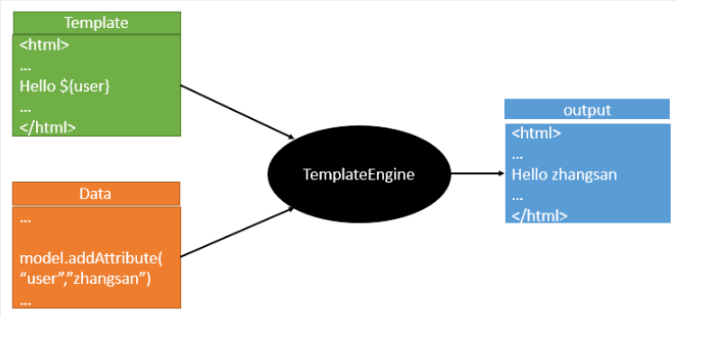
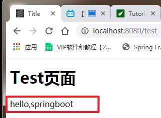
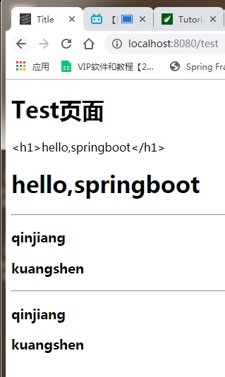

# Thymeleaf

## 模板引擎

- 前端交给我们的页面，是html页面。如果是我们以前开发，我们需要把他们转成jsp页面，jsp好处就是当我们查出一些数据转发到JSP页面以后，我们可以用jsp轻松实现数据的显示，及交互等。

- jsp支持非常强大的功能，包括能写Java代码，但是呢，我们现在的这种情况，SpringBoot这个项目首先是以jar的方式，不是war，像第二，我们用的还是嵌入式的Tomcat，所以呢，**他现在默认是不支持jsp的**。

- 那不支持jsp，如果我们直接用纯静态页面的方式，那给我们开发会带来非常大的麻烦，那怎么办呢？

**SpringBoot推荐你可以来使用模板引擎：**

模板引擎，我们其实大家听到很多，其实jsp就是一个模板引擎，还有用的比较多的freemarker，包括SpringBoot给我们推荐的Thymeleaf，模板引擎有非常多，但再多的模板引擎，他们的思想都是一样的，什么样一个思想呢我们来看一下这张图：




模板引擎的作用就是我们来写一个页面模板，比如有些值呢，是动态的，我们写一些表达式。而这些值，从哪来呢，就是我们在后台封装一些数据。然后把这个模板和这个数据交给我们模板引擎，模板引擎按照我们这个数据帮你把这表达式解析、填充到我们指定的位置，然后把这个数据最终生成一个我们想要的内容给我们写出去，这就是我们这个模板引擎，不管是jsp还是其他模板引擎，都是这个思想。只不过呢，就是说不同模板引擎之间，他们可能这个语法有点不一样。其他的我就不介绍了，我主要来介绍一下SpringBoot给我们推荐的Thymeleaf模板引擎，这模板引擎呢，是一个高级语言的模板引擎，他的这个语法更简单。而且呢，功能更强大。

我们呢，就来看一下这个模板引擎，那既然要看这个模板引擎。首先，我们来看SpringBoot里边怎么用。

##  引入Thymeleaf

怎么引入呢，对于springboot来说，什么事情不都是一个start的事情嘛，我们去在项目中引入一下。给大家三个网址：

- Thymeleaf 官网：[https://www.thymeleaf.org/](https://www.thymeleaf.org/)

- Thymeleaf 在Github 的主页：[https://github.com/thymeleaf/thymeleaf](https://github.com/thymeleaf/thymeleaf)

- Spring官方文档：找到我们对应的版本[https://docs.spring.io/spring-boot/docs/2.2.5.RELEASE/reference/htmlsingle/#using-boot-starter ](https://docs.spring.io/spring-boot/docs/2.2.5.RELEASE/reference/htmlsingle/#using-boot-starter )

找到对应的pom依赖：可以适当点进源码看下本来的包！

```xml
<!--thymeleaf-->
<dependency>
    <groupId>org.springframework.boot</groupId>
    <artifactId>spring-boot-starter-thymeleaf</artifactId>
</dependency>
```

Maven会自动下载jar包，我们可以去看下下载的东西；


## Thymeleaf分析

前面呢，我们已经引入了Thymeleaf，那这个要怎么使用呢？

我们首先得按照SpringBoot的自动配置原理看一下我们这个Thymeleaf的自动配置规则，在按照那个规则，我们进行使用。

我们去找一下Thymeleaf的自动配置类：`ThymeleafProperties`

```java
@ConfigurationProperties(
    prefix = "spring.thymeleaf"
)
public class ThymeleafProperties {
    private static final Charset DEFAULT_ENCODING;
    public static final String DEFAULT_PREFIX = "classpath:/templates/";
    public static final String DEFAULT_SUFFIX = ".html";
    private boolean checkTemplate = true;
    private boolean checkTemplateLocation = true;
    private String prefix = "classpath:/templates/";
    private String suffix = ".html";
    private String mode = "HTML";
    private Charset encoding;
}
```

我们可以在其中看到默认的前缀和后缀！

我们只需要把我们的html页面放在类路径下的templates下，thymeleaf就可以帮我们自动渲染了。

使用thymeleaf什么都不需要配置，只需要将他放在指定的文件夹下即可！

**<font color=red>测试</font>**

1. 编写一个TestController

   ```java
   @Controller
   public class TestController {
       
       @RequestMapping("/test")
       public String test1(){
           //classpath:/templates/test.html
           return "test";
       }
       
   }
   ```

2. 编写一个测试页面  test.html 放在 templates 目录下

   ```html
   <!DOCTYPE html>
   <html lang="en">
   <head>
       <meta charset="UTF-8">
       <title>Title</title>
   </head>
   <body>
   <h1>Test页面</h1>
   </body>
   </html>
   ```

3. 启动项目请求测试


## Thymeleaf 语法学习

要学习语法，还是参考官网文档最为准确，我们找到对应的版本看一下；

Thymeleaf 官网：[https://www.thymeleaf.org/](https://www.thymeleaf.org/ ) ， 简单看一下官网！我们去下载Thymeleaf的官方文档！在线文档：[https://www.thymeleaf.org/doc/tutorials/3.0/usingthymeleaf.html](https://www.thymeleaf.org/doc/tutorials/3.0/usingthymeleaf.html)

### Thymeleaf入门

**我们做个最简单的练习 ：我们需要查出一些数据，在页面中展示**

1. 修改测试请求，增加数据传输；

   ```java
   @RequestMapping("/t1")
   public String test1(Model model){
       //存入数据
       model.addAttribute("msg","Hello,Thymeleaf");
       //classpath:/templates/test.html
       return "test";
   }
   ```

2. 我们要使用thymeleaf，需要在html文件中导入命名空间的约束，方便提示。

   我们可以去官方文档的#3中看一下命名空间拿来过来：

   ```
    xmlns:th="http://www.thymeleaf.org"
   ```

3. 我们去编写下前端页面

   ```html
   <!DOCTYPE html>
   <html lang="en" xmlns:th="http://www.thymeleaf.org">
   <head>
       <meta charset="UTF-8">
       <title>狂神说</title>
   </head>
   <body>
   <h1>测试页面</h1>
   
   <!--th:text就是将div中的内容设置为它指定的值，和之前学习的Vue一样-->
   <div th:text="${msg}"></div>
   </body>
   </html>
   ```

4. 启动测试！

   

   

**OK，入门搞定，我们来认真研习一下Thymeleaf的使用语法！**

### Thymeleaf语法

**1、我们可以使用任意的 th:attr 来替换Html中原生属性的值！**

**2、我们能写哪些表达式呢？**

```shell
Simple expressions:（表达式语法）
Variable Expressions: ${...}：获取变量值；OGNL；
    1）、获取对象的属性、调用方法
    2）、使用内置的基本对象：#18
         #ctx : the context object.
         #vars: the context variables.
         #locale : the context locale.
         #request : (only in Web Contexts) the HttpServletRequest object.
         #response : (only in Web Contexts) the HttpServletResponse object.
         #session : (only in Web Contexts) the HttpSession object.
         #servletContext : (only in Web Contexts) the ServletContext object.

    3）、内置的一些工具对象：
　　　　　　#execInfo : information about the template being processed.
　　　　　　#uris : methods for escaping parts of URLs/URIs
　　　　　　#conversions : methods for executing the configured conversion service (if any).
　　　　　　#dates : methods for java.util.Date objects: formatting, component extraction, etc.
　　　　　　#calendars : analogous to #dates , but for java.util.Calendar objects.
　　　　　　#numbers : methods for formatting numeric objects.
　　　　　　#strings : methods for String objects: contains, startsWith, prepending/appending, etc.
　　　　　　#objects : methods for objects in general.
　　　　　　#bools : methods for boolean evaluation.
　　　　　　#arrays : methods for arrays.
　　　　　　#lists : methods for lists.
　　　　　　#sets : methods for sets.
　　　　　　#maps : methods for maps.
　　　　　　#aggregates : methods for creating aggregates on arrays or collections.
==================================================================================

  Selection Variable Expressions: *{...}：选择表达式：和${}在功能上是一样；
  Message Expressions: #{...}：获取国际化内容
  Link URL Expressions: @{...}：定义URL；
  Fragment Expressions: ~{...}：片段引用表达式

Literals（字面量）
      Text literals: 'one text' , 'Another one!' ,…
      Number literals: 0 , 34 , 3.0 , 12.3 ,…
      Boolean literals: true , false
      Null literal: null
      Literal tokens: one , sometext , main ,…
      
Text operations:（文本操作）
    String concatenation: +
    Literal substitutions: |The name is ${name}|
    
Arithmetic operations:（数学运算）
    Binary operators: + , - , * , / , %
    Minus sign (unary operator): -
    
Boolean operations:（布尔运算）
    Binary operators: and , or
    Boolean negation (unary operator): ! , not
    
Comparisons and equality:（比较运算）
    Comparators: > , < , >= , <= ( gt , lt , ge , le )
    Equality operators: == , != ( eq , ne )
    
Conditional operators:条件运算（三元运算符）
    If-then: (if) ? (then)
    If-then-else: (if) ? (then) : (else)
    Default: (value) ?: (defaultvalue)
    
Special tokens:
    No-Operation: _
```

**练习测试：**

1、 我们编写一个Controller，放一些数据

```java

@RequestMapping("/test2")
public String test2(Map<String,Object> map){
    //存入数据
    map.put("msg","<h1>Hello</h1>");
    map.put("users", Arrays.asList("qinjiang","kuangshen"));
    //classpath:/templates/test.html
    return "test";
}
```

2、测试页面取出数据

```html
<!DOCTYPE html>
<html lang="en" xmlns:th="http://www.thymeleaf.org">
<head>
    <meta charset="UTF-8">
    <title>Title</title>
</head>
<body>
<div>
    <h1>Test页面</h1>
    <!--不转义-->
    <div th:text="${msg}"></div>
    <!--转义-->
    <div th:utext="${msg}"></div>

    <hr>
	<!--遍历数据-->
	<!--th:each每次遍历都会生成当前这个标签：官网#9-->
    <h3 th:each="user:${users}" th:text="${user}"></h3>
    <hr>
     <!--行内写法：官网#12-->
    <h3 th:each="user:${users}">[[ ${user} ]]</h3>
</div>
</body>
</html>
```

3、启动项目测试！



**我们看完语法，很多样式，我们即使现在学习了，也会忘记，所以我们在学习过程中，需要使用什么，根据官方文档来查询，才是最重要的，要熟练使用官方文档！**